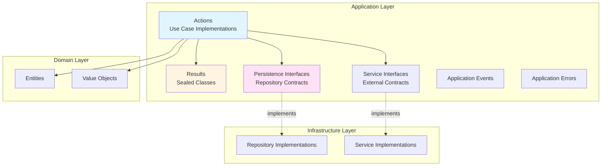
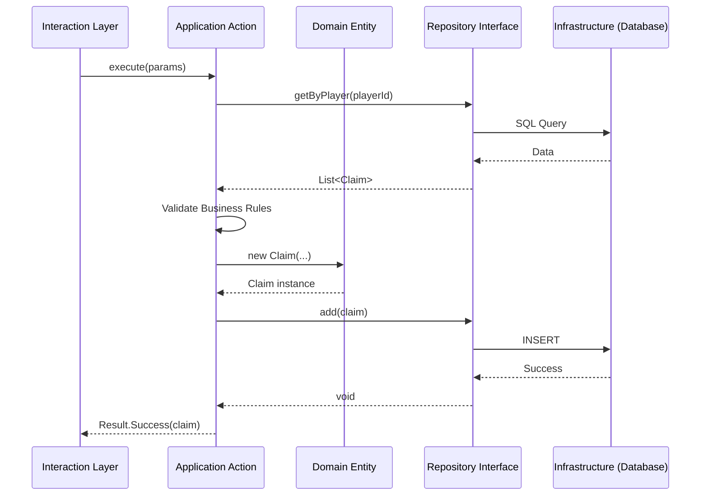
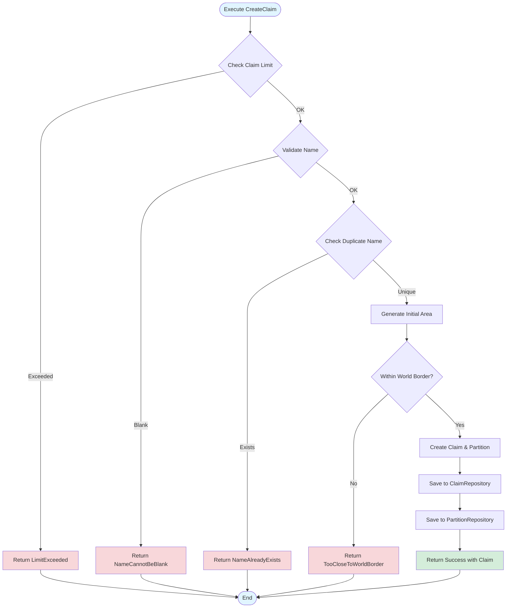
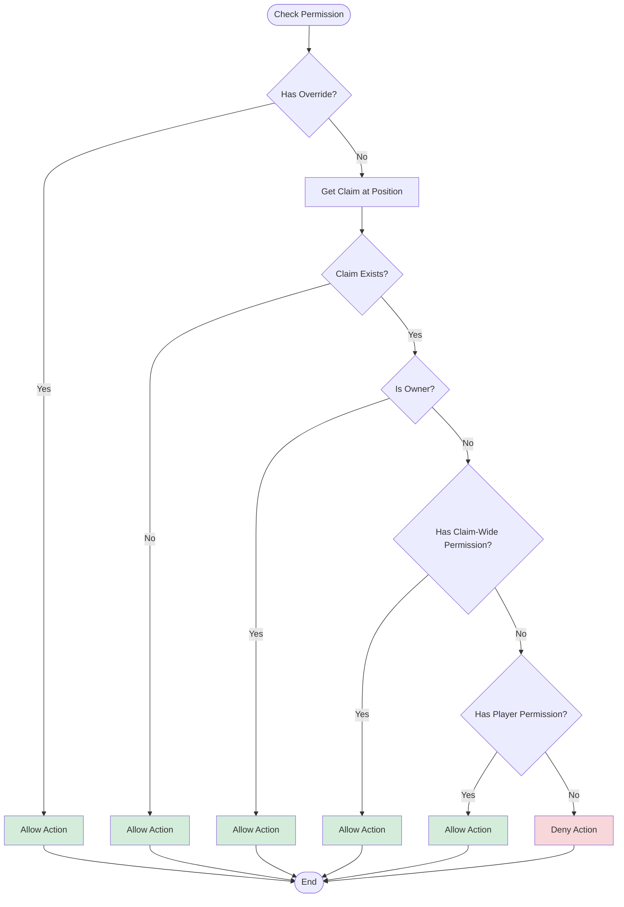
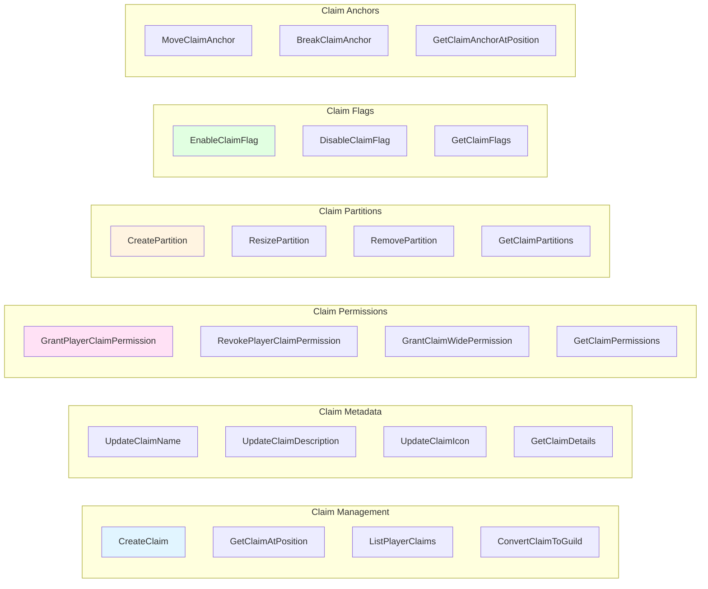
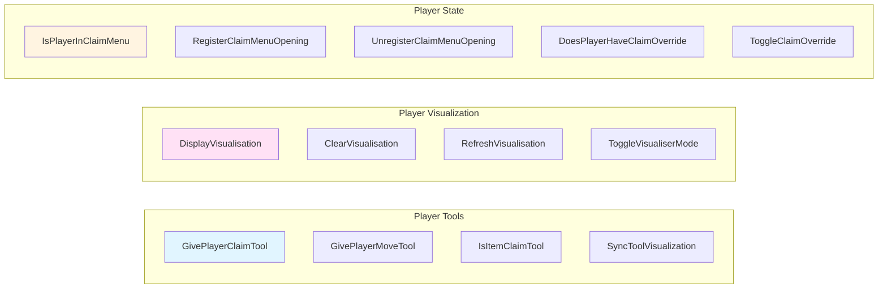

# Application Layer Documentation

The application layer (`net.lumalyte.lg.application`) orchestrates use cases and defines the contracts (interfaces) that outer layers must implement. This layer coordinates domain objects to fulfill business requirements.

## Layer Overview



## Package Structure

```
net.lumalyte.lg.application
├── actions/           # Use case implementations
│   ├── claim/
│   │   ├── CreateClaim.kt
│   │   ├── ConvertClaimToGuild.kt
│   │   ├── anchor/
│   │   ├── flag/
│   │   ├── metadata/
│   │   ├── partition/
│   │   ├── permission/
│   │   └── transfer/
│   └── player/
│       ├── tool/
│       └── visualisation/
├── results/           # Action outcomes
│   ├── claim/
│   └── player/
├── persistence/       # Repository interfaces
├── services/          # Service interfaces (not in codebase currently)
├── events/            # Application events
└── errors/            # Application exceptions
```

## Actions (Use Cases)

Actions encapsulate business use cases. Each action:
- Has a single `execute()` method
- Receives dependencies via constructor injection
- Returns a sealed `Result` class
- Coordinates domain objects
- Calls repository interfaces

### Action Flow Pattern



### CreateClaim Action

Creates a new claim for a player.

```kotlin
package net.lumalyte.lg.application.actions.claim

class CreateClaim(
    private val claimRepository: ClaimRepository,
    private val partitionRepository: PartitionRepository,
    private val playerMetadataService: PlayerMetadataService,
    private val worldManipulationService: WorldManipulationService,
    private val guildService: GuildService,
    private val config: MainConfig
) {
    fun execute(
        playerId: UUID,
        name: String,
        position3D: Position3D,
        worldId: UUID
    ): CreateClaimResult {
        // 1. Check claim limit
        val existingClaims = claimRepository.getByPlayer(playerId)
        val claimLimit = playerMetadataService.getPlayerClaimLimit(playerId)

        if (existingClaims.count() >= claimLimit) {
            return CreateClaimResult.LimitExceeded
        }

        // 2. Validate name
        if (name.isBlank()) {
            return CreateClaimResult.NameCannotBeBlank
        }

        // 3. Check for duplicate names
        val existingClaim = claimRepository.getByName(playerId, name)
        if (existingClaim != null) {
            return CreateClaimResult.NameAlreadyExists
        }

        // 4. Generate initial partition area
        val areaSize = config.initialClaimSize
        val offsetMin = (areaSize - 1) / 2
        val offsetMax = areaSize / 2
        val area = Area(
            Position2D(position3D.x - offsetMin, position3D.z - offsetMin),
            Position2D(position3D.x + offsetMax, position3D.z + offsetMax)
        )

        // 5. Validate within world border
        if (!worldManipulationService.isInsideWorldBorder(worldId, area)) {
            return CreateClaimResult.TooCloseToWorldBorder
        }

        // 6. Create and persist claim
        val newClaim = Claim(worldId, playerId, null, position3D, name)
        val partition = Partition(newClaim.id, area)

        claimRepository.add(newClaim)
        partitionRepository.add(partition)

        return CreateClaimResult.Success(newClaim)
    }
}
```

**Usage from Interaction Layer:**
```kotlin
// In a command or listener
val result = createClaim.execute(
    playerId = player.uniqueId,
    name = "MyBase",
    position3D = Position3D(x, y, z),
    worldId = world.uid
)

when (result) {
    is CreateClaimResult.Success -> {
        player.sendMessage("Claim '${result.claim.name}' created!")
    }
    CreateClaimResult.LimitExceeded -> {
        player.sendMessage("You've reached your claim limit!")
    }
    CreateClaimResult.NameCannotBeBlank -> {
        player.sendMessage("Claim name cannot be blank!")
    }
    CreateClaimResult.NameAlreadyExists -> {
        player.sendMessage("You already have a claim with that name!")
    }
    CreateClaimResult.TooCloseToWorldBorder -> {
        player.sendMessage("Too close to world border!")
    }
}
```

### CreateClaim Flow Diagram



### GrantPlayerClaimPermission Action

Grants a specific permission to a player within a claim.

```kotlin
package net.lumalyte.lg.application.actions.claim.permission

class GrantPlayerClaimPermission(
    private val playerAccessRepository: PlayerAccessRepository,
    private val claimRepository: ClaimRepository
) {
    /**
     * Grants a permission to a player in a claim.
     *
     * @param claimId The claim to grant permission in
     * @param playerId The player receiving the permission
     * @param permission The permission to grant
     * @return Result indicating success or failure reason
     */
    fun execute(
        claimId: UUID,
        playerId: UUID,
        permission: ClaimPermission
    ): GrantPlayerClaimPermissionResult {
        // 1. Verify claim exists
        claimRepository.getById(claimId)
            ?: return GrantPlayerClaimPermissionResult.ClaimNotFound

        // 2. Add permission
        return try {
            when (playerAccessRepository.add(claimId, playerId, permission)) {
                true -> GrantPlayerClaimPermissionResult.Success
                false -> GrantPlayerClaimPermissionResult.AlreadyExists
            }
        } catch (error: DatabaseOperationException) {
            println("Error has occurred trying to save to the database")
            GrantPlayerClaimPermissionResult.StorageError
        }
    }
}
```

**Usage Example:**
```kotlin
val result = grantPlayerClaimPermission.execute(
    claimId = claim.id,
    playerId = trustedPlayer.uniqueId,
    permission = ClaimPermission.BUILD
)

when (result) {
    GrantPlayerClaimPermissionResult.Success ->
        owner.sendMessage("Granted BUILD permission to ${trustedPlayer.name}")
    GrantPlayerClaimPermissionResult.ClaimNotFound ->
        owner.sendMessage("Claim not found!")
    GrantPlayerClaimPermissionResult.AlreadyExists ->
        owner.sendMessage("${trustedPlayer.name} already has BUILD permission")
    GrantPlayerClaimPermissionResult.StorageError ->
        owner.sendMessage("Database error - please contact admin")
}
```

### IsPlayerActionAllowed Action

Checks if a player can perform an action at a specific location.

```kotlin
package net.lumalyte.lg.application.actions.claim

class IsPlayerActionAllowed(
    private val getClaimAtPosition: GetClaimAtPosition,
    private val getClaimPermissions: GetClaimPermissions,
    private val doesPlayerHaveClaimOverride: DoesPlayerHaveClaimOverride,
    private val claimFlagRepository: ClaimFlagRepository
) {
    fun execute(
        playerId: UUID,
        position: Position3D,
        worldId: UUID,
        permission: ClaimPermission
    ): IsPlayerActionAllowedResult {
        // 1. Check if player has override (admin bypass)
        if (doesPlayerHaveClaimOverride.execute(playerId)) {
            return IsPlayerActionAllowedResult.Allowed
        }

        // 2. Get claim at position
        val claimResult = getClaimAtPosition.execute(position, worldId)

        if (claimResult !is GetClaimAtPositionResult.Success) {
            // No claim at this position - action allowed
            return IsPlayerActionAllowedResult.Allowed
        }

        val claim = claimResult.claim

        // 3. Owner always has permission
        if (claim.playerId == playerId) {
            return IsPlayerActionAllowedResult.Allowed
        }

        // 4. Check claim-wide permissions
        val claimWidePerms = getClaimPermissions.execute(claim.id)
        if (claimWidePerms.contains(permission)) {
            return IsPlayerActionAllowedResult.Allowed
        }

        // 5. Check player-specific permissions
        val playerPerms = getClaimPlayerPermissions.execute(claim.id, playerId)
        if (playerPerms.contains(permission)) {
            return IsPlayerActionAllowedResult.Allowed
        }

        // 6. Permission denied
        return IsPlayerActionAllowedResult.Denied(claim)
    }
}
```

**Permission Check Flow:**



## Common Action Patterns

### Claim Actions



### Player Actions



## Result Classes

Results are sealed classes that represent all possible outcomes of an action. This eliminates the need for exception handling for business logic failures.

### Result Pattern Benefits

1. **Type-safe**: Compiler ensures all cases are handled
2. **Explicit**: All possible outcomes visible in the type
3. **No exceptions**: Business failures are values, not exceptions
4. **Composable**: Easy to chain and transform

### CreateClaimResult

```kotlin
package net.lumalyte.lg.application.results.claim

sealed class CreateClaimResult {
    data class Success(val claim: Claim) : CreateClaimResult()
    object NameCannotBeBlank : CreateClaimResult()
    object LimitExceeded : CreateClaimResult()
    object NameAlreadyExists : CreateClaimResult()
    object TooCloseToWorldBorder : CreateClaimResult()
}
```

### GrantPlayerClaimPermissionResult

```kotlin
package net.lumalyte.lg.application.results.claim.permission

sealed class GrantPlayerClaimPermissionResult {
    object Success : GrantPlayerClaimPermissionResult()
    object ClaimNotFound : GrantPlayerClaimPermissionResult()
    object AlreadyExists : GrantPlayerClaimPermissionResult()
    object StorageError : GrantPlayerClaimPermissionResult()
}
```

### IsPlayerActionAllowedResult

```kotlin
package net.lumalyte.lg.application.results.claim

sealed class IsPlayerActionAllowedResult {
    object Allowed : IsPlayerActionAllowedResult()
    data class Denied(val claim: Claim) : IsPlayerActionAllowedResult()
}
```

### Result Handling Pattern

```kotlin
// Pattern: Exhaustive when expressions
when (val result = createClaim.execute(/* ... */)) {
    is CreateClaimResult.Success -> {
        // Handle success, access result.claim
    }
    CreateClaimResult.NameCannotBeBlank -> {
        // Handle blank name
    }
    CreateClaimResult.LimitExceeded -> {
        // Handle limit exceeded
    }
    CreateClaimResult.NameAlreadyExists -> {
        // Handle duplicate name
    }
    CreateClaimResult.TooCloseToWorldBorder -> {
        // Handle border violation
    }
    // Compiler ensures all cases handled
}
```

## Repository Interfaces (Ports)

Repository interfaces define the contract for data access. The infrastructure layer implements these.

### ClaimRepository

```kotlin
package net.lumalyte.lg.application.persistence

interface ClaimRepository {
    fun add(claim: Claim)
    fun update(claim: Claim)
    fun remove(claim: Claim)
    fun getById(id: UUID): Claim?
    fun getByPlayer(playerId: UUID): List<Claim>
    fun getByName(playerId: UUID, name: String): Claim?
    fun getAll(): List<Claim>
}
```

### PartitionRepository

```kotlin
package net.lumalyte.lg.application.persistence

interface PartitionRepository {
    fun add(partition: Partition)
    fun update(partition: Partition)
    fun remove(partition: Partition)
    fun getById(id: UUID): Partition?
    fun getByClaim(claimId: UUID): List<Partition>
    fun getByPosition(position: Position2D, worldId: UUID): Partition?
    fun getAll(): List<Partition>
}
```

### ClaimPermissionRepository

```kotlin
package net.lumalyte.lg.application.persistence

interface ClaimPermissionRepository {
    fun addClaimWidePermission(claimId: UUID, permission: ClaimPermission): Boolean
    fun removeClaimWidePermission(claimId: UUID, permission: ClaimPermission): Boolean
    fun getClaimWidePermissions(claimId: UUID): Set<ClaimPermission>
    fun clearClaimWidePermissions(claimId: UUID)
}
```

### PlayerAccessRepository

```kotlin
package net.lumalyte.lg.application.persistence

interface PlayerAccessRepository {
    fun add(claimId: UUID, playerId: UUID, permission: ClaimPermission): Boolean
    fun remove(claimId: UUID, playerId: UUID, permission: ClaimPermission): Boolean
    fun getPlayerPermissions(claimId: UUID, playerId: UUID): Set<ClaimPermission>
    fun getPlayersWithPermission(claimId: UUID, permission: ClaimPermission): List<UUID>
    fun clearPlayerPermissions(claimId: UUID, playerId: UUID)
}
```

## Application Events

Events that represent application-level occurrences (different from domain events).

```kotlin
package net.lumalyte.lg.application.events

data class PartitionModificationEvent(
    val claimId: UUID,
    val partitionId: UUID,
    val modificationType: ModificationType,
    val affectedChunks: List<Position2D>
) {
    enum class ModificationType {
        CREATED,
        RESIZED,
        REMOVED
    }
}
```

**Usage:**
```kotlin
// After partition modification
val event = PartitionModificationEvent(
    claimId = partition.claimId,
    partitionId = partition.id,
    modificationType = ModificationType.CREATED,
    affectedChunks = partition.getChunks()
)

eventBus.publish(event)

// Listeners can react (e.g., update chunk cache)
```

## Application Errors

Errors specific to application layer concerns.

```kotlin
package net.lumalyte.lg.application.errors

class DatabaseOperationException(
    message: String,
    cause: Throwable? = null
) : Exception(message, cause)

class PlayerNotFoundException(
    val playerId: UUID
) : Exception("Player not found: $playerId")
```

## Dependency Injection

Actions receive dependencies through constructor injection:

```kotlin
// Koin module definition
val applicationModule = module {
    // Repositories (implemented in infrastructure)
    single<ClaimRepository> { ExposedClaimRepository(get()) }
    single<PartitionRepository> { ExposedPartitionRepository(get()) }

    // Services
    single { PlayerMetadataService(get()) }
    single { WorldManipulationService(get()) }

    // Actions (factory = new instance each time)
    factory { CreateClaim(get(), get(), get(), get(), get(), get()) }
    factory { GrantPlayerClaimPermission(get(), get()) }
    factory { IsPlayerActionAllowed(get(), get(), get(), get()) }
}
```

**Retrieving Actions:**
```kotlin
class ClaimCommand : CommandExecutor {
    private val createClaim: CreateClaim by inject()

    override fun onCommand(/* ... */): Boolean {
        val result = createClaim.execute(/* ... */)
        // Handle result...
    }
}
```

## Testing Actions

Actions are easy to test with mocked dependencies:

```kotlin
class CreateClaimTest {
    private lateinit var mockClaimRepo: ClaimRepository
    private lateinit var mockPartitionRepo: PartitionRepository
    private lateinit var mockPlayerMetadata: PlayerMetadataService
    private lateinit var mockWorldService: WorldManipulationService
    private lateinit var mockGuildService: GuildService
    private lateinit var mockConfig: MainConfig

    private lateinit var createClaim: CreateClaim

    @BeforeEach
    fun setup() {
        mockClaimRepo = mockk()
        mockPartitionRepo = mockk()
        mockPlayerMetadata = mockk()
        mockWorldService = mockk()
        mockGuildService = mockk()
        mockConfig = mockk()

        createClaim = CreateClaim(
            mockClaimRepo,
            mockPartitionRepo,
            mockPlayerMetadata,
            mockWorldService,
            mockGuildService,
            mockConfig
        )
    }

    @Test
    fun `should create claim when all validations pass`() {
        // Arrange
        val playerId = UUID.randomUUID()
        every { mockClaimRepo.getByPlayer(playerId) } returns emptyList()
        every { mockPlayerMetadata.getPlayerClaimLimit(playerId) } returns 5
        every { mockClaimRepo.getByName(playerId, any()) } returns null
        every { mockConfig.initialClaimSize } returns 15
        every { mockWorldService.isInsideWorldBorder(any(), any()) } returns true
        every { mockClaimRepo.add(any()) } just Runs
        every { mockPartitionRepo.add(any()) } just Runs

        // Act
        val result = createClaim.execute(
            playerId,
            "TestClaim",
            Position3D(0, 64, 0),
            UUID.randomUUID()
        )

        // Assert
        assertTrue(result is CreateClaimResult.Success)
        verify { mockClaimRepo.add(any()) }
        verify { mockPartitionRepo.add(any()) }
    }

    @Test
    fun `should return LimitExceeded when player has too many claims`() {
        // Arrange
        val playerId = UUID.randomUUID()
        every { mockClaimRepo.getByPlayer(playerId) } returns listOf(
            mockk(), mockk(), mockk()  // 3 existing claims
        )
        every { mockPlayerMetadata.getPlayerClaimLimit(playerId) } returns 3

        // Act
        val result = createClaim.execute(
            playerId,
            "TestClaim",
            Position3D(0, 64, 0),
            UUID.randomUUID()
        )

        // Assert
        assertEquals(CreateClaimResult.LimitExceeded, result)
        verify(exactly = 0) { mockClaimRepo.add(any()) }
    }
}
```

## Best Practices

### 1. Single Responsibility
Each action does ONE thing:
```kotlin
// Good: Focused action
class CreateClaim { /* ... */ }
class UpdateClaimName { /* ... */ }

// Bad: God action
class ManageClaim {
    fun create() { }
    fun update() { }
    fun delete() { }
}
```

### 2. Explicit Results
Use sealed classes for all outcomes:
```kotlin
// Good: All outcomes explicit
sealed class CreateClaimResult {
    data class Success(val claim: Claim) : CreateClaimResult()
    object LimitExceeded : CreateClaimResult()
    // ... all possible outcomes
}

// Bad: Throwing exceptions for business logic
fun create(): Claim {
    if (limitExceeded) throw ClaimLimitException()
    // ...
}
```

### 3. Validate Early
Check preconditions before doing work:
```kotlin
fun execute(playerId: UUID, name: String): Result {
    // Validate first
    if (name.isBlank()) return Result.InvalidName

    // Then do expensive operations
    val claims = repository.getByPlayer(playerId)
    // ...
}
```

### 4. Dependency Injection
Always use constructor injection:
```kotlin
// Good: Dependencies explicit
class CreateClaim(
    private val claimRepository: ClaimRepository,
    private val config: MainConfig
) {
    fun execute(/* ... */) { }
}

// Bad: Hidden dependencies
class CreateClaim {
    fun execute(/* ... */) {
        val repo = ServiceLocator.get<ClaimRepository>()  // Hidden!
    }
}
```

### 5. Immutable Results
Results should be immutable:
```kotlin
// Good: Immutable result
data class Success(val claim: Claim) : CreateClaimResult()

// Bad: Mutable result
class Success(var claim: Claim) : CreateClaimResult()
```

## Complete Action Example

Here's a complete action from start to finish:

```kotlin
package net.lumalyte.lg.application.actions.claim.partition

class CreatePartition(
    private val partitionRepository: PartitionRepository,
    private val claimRepository: ClaimRepository,
    private val playerMetadataService: PlayerMetadataService,
    private val getClaimBlockCount: GetClaimBlockCount
) {
    fun execute(
        claimId: UUID,
        area: Area
    ): CreatePartitionResult {
        // 1. Verify claim exists
        val claim = claimRepository.getById(claimId)
            ?: return CreatePartitionResult.ClaimNotFound

        // 2. Check for overlaps
        val existingPartitions = partitionRepository.getByClaim(claimId)
        if (existingPartitions.any { it.isAreaOverlap(area) }) {
            return CreatePartitionResult.OverlapsExistingPartition
        }

        // 3. Check block limit
        val currentBlocks = getClaimBlockCount.execute(claimId)
        val newBlocks = area.getBlockCount()
        val playerLimit = playerMetadataService.getPlayerClaimBlockLimit(claim.playerId)

        if (currentBlocks + newBlocks > playerLimit) {
            return CreatePartitionResult.InsufficientBlocks(
                required = newBlocks,
                available = playerLimit - currentBlocks
            )
        }

        // 4. Create partition
        val partition = Partition(claimId, area)
        partitionRepository.add(partition)

        return CreatePartitionResult.Success(partition)
    }
}

// Result class
sealed class CreatePartitionResult {
    data class Success(val partition: Partition) : CreatePartitionResult()
    object ClaimNotFound : CreatePartitionResult()
    object OverlapsExistingPartition : CreatePartitionResult()
    data class InsufficientBlocks(
        val required: Int,
        val available: Int
    ) : CreatePartitionResult()
}
```

## Related Documentation

- [Domain Layer](./domain.md) - Understanding entities and value objects
- [Infrastructure Layer](./infrastructure.md) - Repository implementations
- [Interaction Layer](./interaction.md) - Using actions from commands
- [Architecture Overview](./architecture.md) - Overall system design
