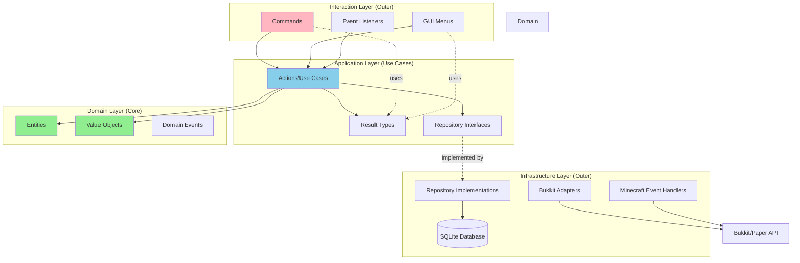
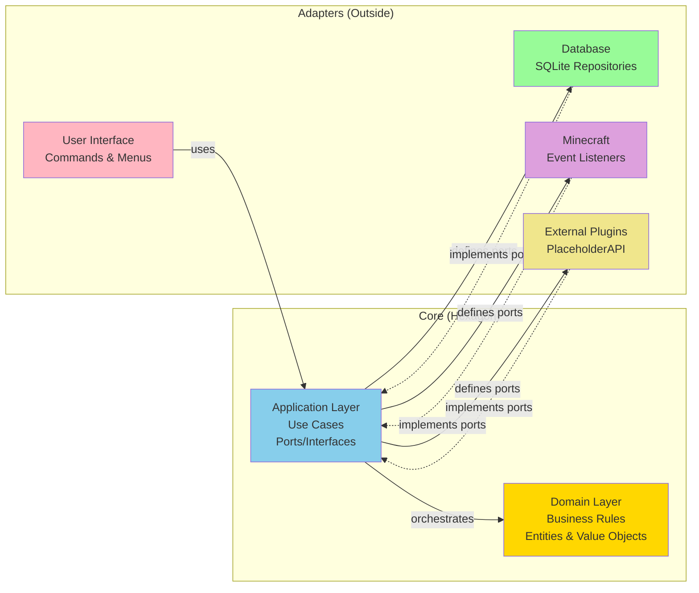

# Architecture Overview

LumaGuilds is built using **Hexagonal Architecture** (also known as Clean Architecture or Ports and Adapters). This architectural pattern ensures that business logic remains independent of external frameworks, making the code maintainable, testable, and adaptable.

## High-Level Architecture



## Hexagonal Architecture Diagram



## Layer Structure

The plugin is organized into four main layers:

### 1. Domain Layer (`net.lumalyte.lg.domain`)

The core business logic layer containing entities, value objects, and domain events. This layer has **zero dependencies** on external frameworks.

**Key Components:**
- **Entities**: Core business objects with identity (`Claim`, `Guild`, `Player`, `Partition`)
- **Value Objects**: Immutable data structures without identity (`Position3D`, `Position2D`, `Area`)
- **Domain Events**: Events that represent something that happened in the domain
- **Domain Exceptions**: Business rule violations

```kotlin
// Example: Claim entity with business logic
package net.lumalyte.lg.domain.entities

data class Claim(
    var id: UUID,
    var worldId: UUID,
    var playerId: UUID,
    var teamId: UUID?,
    val creationTime: Instant,
    val name: String,
    val description: String,
    val position: Position3D,
    val icon: String
) {
    init {
        // Domain invariants enforced in constructor
        require(name.length in 1..50) { "Name must be between 1 and 50 characters." }
        require(description.length <= 300) { "Description cannot exceed 300 characters." }
    }

    fun resetBreakCount() {
        // Business logic method
    }
}
```

```kotlin
// Example: Position3D value object
package net.lumalyte.lg.domain.values

data class Position3D(val x: Int, val y: Int, val z: Int)
```

### 2. Application Layer (`net.lumalyte.lg.application`)

Orchestrates use cases and coordinates domain objects. Defines interfaces (ports) that the infrastructure must implement.

**Key Components:**
- **Actions**: Use case implementations (e.g., `CreateClaim`, `GrantPlayerClaimPermission`)
- **Results**: Sealed classes representing action outcomes
- **Persistence Interfaces**: Repository contracts
- **Events**: Application-level events

```kotlin
// Example: CreateClaim action (use case)
package net.lumalyte.lg.application.actions.claim

class CreateClaim(
    private val claimRepository: ClaimRepository,
    private val partitionRepository: PartitionRepository,
    private val playerMetadataService: PlayerMetadataService,
    private val worldManipulationService: WorldManipulationService,
    private val guildService: GuildService,
    private val config: MainConfig
) {
    fun execute(
        playerId: UUID,
        name: String,
        position3D: Position3D,
        worldId: UUID
    ): CreateClaimResult {
        // Validate claim limit
        val existingClaims = claimRepository.getByPlayer(playerId)
        val claimLimit = playerMetadataService.getPlayerClaimLimit(playerId)

        if (existingClaims.count() >= claimLimit) {
            return CreateClaimResult.LimitExceeded
        }

        // Create claim and partition
        val newClaim = Claim(worldId, playerId, null, position3D, name)
        val partition = Partition(newClaim.id, area)

        claimRepository.add(newClaim)
        partitionRepository.add(partition)

        return CreateClaimResult.Success(newClaim)
    }
}
```

```kotlin
// Example: Result sealed class
package net.lumalyte.lg.application.results.claim

sealed class CreateClaimResult {
    data class Success(val claim: Claim) : CreateClaimResult()
    object LimitExceeded : CreateClaimResult()
    object NameCannotBeBlank : CreateClaimResult()
    object NameAlreadyExists : CreateClaimResult()
    object TooCloseToWorldBorder : CreateClaimResult()
}
```

```kotlin
// Example: Repository interface (port)
package net.lumalyte.lg.application.persistence

interface ClaimRepository {
    fun add(claim: Claim)
    fun update(claim: Claim)
    fun remove(claim: Claim)
    fun getById(id: UUID): Claim?
    fun getByPlayer(playerId: UUID): List<Claim>
    fun getByName(playerId: UUID, name: String): Claim?
    fun getAll(): List<Claim>
}
```

### 3. Infrastructure Layer (`net.lumalyte.lg.infrastructure`)

Implements the interfaces defined by the application layer. Handles all external concerns.

**Key Components:**
- **Persistence**: Database implementations of repositories
- **Adapters**: Bukkit/Paper API integrations
- **Listeners**: Minecraft event handlers
- **Services**: Technical services (caching, messaging, etc.)
- **Placeholders**: PlaceholderAPI integration

```kotlin
// Example: Repository implementation (adapter)
package net.lumalyte.lg.infrastructure.persistence.claims

class ExposedClaimRepository(
    private val database: Database
) : ClaimRepository {
    override fun add(claim: Claim) = transaction(database) {
        ClaimTable.insert {
            it[id] = claim.id
            it[worldId] = claim.worldId
            it[playerId] = claim.playerId
            it[teamId] = claim.teamId
            it[creationTime] = claim.creationTime
            it[name] = claim.name
            it[description] = claim.description
            it[positionX] = claim.position.x
            it[positionY] = claim.position.y
            it[positionZ] = claim.position.z
            it[icon] = claim.icon
        }
    }

    override fun getByPlayer(playerId: UUID): List<Claim> = transaction(database) {
        ClaimTable.select { ClaimTable.playerId eq playerId }
            .map { it.toClaim() }
    }
}
```

```kotlin
// Example: Bukkit adapter
package net.lumalyte.lg.infrastructure.adapters.bukkit

class BukkitWorldAdapter(
    private val server: Server
) : WorldManipulationService {
    override fun isInsideWorldBorder(worldId: UUID, area: Area): Boolean {
        val world = server.getWorld(worldId) ?: return false
        val border = world.worldBorder

        return area.minPosition.x >= border.center.x - border.size / 2 &&
               area.maxPosition.x <= border.center.x + border.size / 2
    }
}
```

### 4. Interaction Layer (`net.lumalyte.lg.interaction`)

Handles player interactions through commands, menus, and event listeners.

**Key Components:**
- **Commands**: Player command handlers
- **Menus**: Inventory GUI implementations
- **Listeners**: Player action listeners (block placement, etc.)

```kotlin
// Example: Command handler
package net.lumalyte.lg.interaction.commands

class ClaimCommand(
    private val createClaim: CreateClaim,
    private val givePlayerClaimTool: GivePlayerClaimTool
) : CommandExecutor {
    override fun onCommand(
        sender: CommandSender,
        command: Command,
        label: String,
        args: Array<String>
    ): Boolean {
        if (sender !is Player) return false

        when {
            args.isEmpty() -> {
                // Give claim tool
                givePlayerClaimTool.execute(sender.uniqueId)
                sender.sendMessage("Received claim tool!")
            }
            args[0] == "create" && args.size == 2 -> {
                val result = createClaim.execute(
                    sender.uniqueId,
                    args[1],
                    Position3D(/* ... */),
                    sender.world.uid
                )

                when (result) {
                    is CreateClaimResult.Success ->
                        sender.sendMessage("Claim created!")
                    CreateClaimResult.LimitExceeded ->
                        sender.sendMessage("You've reached your claim limit!")
                    // Handle other results...
                }
            }
        }
        return true
    }
}
```

## Dependency Flow

```
Interaction Layer (commands, menus)
         ↓
   Application Layer (actions, use cases)
         ↓
     Domain Layer (entities, value objects)
         ↑
  Infrastructure Layer (implements interfaces)
```

**Key Principles:**
- **Dependencies point inward**: Outer layers depend on inner layers, never the reverse
- **Domain is independent**: No framework dependencies in domain layer
- **Application defines contracts**: Infrastructure implements what application needs
- **Dependency injection**: Koin is used to wire components (see `net.lumalyte.lg.di`)

## Dependency Injection

The plugin uses **Koin** for dependency injection. All components are wired in the `di` package.

```kotlin
// Example: Koin module configuration
package net.lumalyte.lg.di

val applicationModule = module {
    // Repositories
    single<ClaimRepository> { ExposedClaimRepository(get()) }

    // Services
    single { PlayerMetadataService(get()) }
    single { WorldManipulationService(get()) }

    // Actions
    factory { CreateClaim(get(), get(), get(), get(), get(), get()) }
    factory { GrantPlayerClaimPermission(get(), get()) }

    // Commands
    single { ClaimCommand(get(), get()) }
}
```

## Data Flow Example: Creating a Claim

1. **Player executes command** → `ClaimCommand` (Interaction Layer)
2. **Command invokes action** → `CreateClaim` (Application Layer)
3. **Action coordinates**:
   - Validates using domain rules
   - Creates `Claim` entity (Domain Layer)
   - Calls `ClaimRepository.add()` (Application interface)
4. **Repository saves** → `ExposedClaimRepository` (Infrastructure Layer)
5. **Result returns** → `CreateClaimResult.Success` (Application Layer)
6. **Command displays feedback** → Player receives message (Interaction Layer)

## Testing Benefits

This architecture enables effective testing:

```kotlin
// Example: Testing an action without database
class CreateClaimTest {
    @Test
    fun `should create claim when player has capacity`() {
        // Mock dependencies
        val mockRepository = mockk<ClaimRepository>()
        every { mockRepository.getByPlayer(any()) } returns emptyList()
        every { mockRepository.add(any()) } just Runs

        val createClaim = CreateClaim(
            mockRepository,
            mockPartitionRepo,
            mockMetadataService,
            mockWorldService,
            mockGuildService,
            mockConfig
        )

        val result = createClaim.execute(playerId, "MyClaim", position, worldId)

        assertTrue(result is CreateClaimResult.Success)
        verify { mockRepository.add(any()) }
    }
}
```

## Package Organization

```
net.lumalyte.lg
├── domain
│   ├── entities       # Core business objects with identity
│   ├── values         # Immutable value objects
│   ├── events         # Domain events
│   └── exceptions     # Domain-specific exceptions
├── application
│   ├── actions        # Use case implementations
│   │   ├── claim
│   │   └── player
│   ├── results        # Action outcome representations
│   ├── persistence    # Repository interfaces
│   └── events         # Application events
├── infrastructure
│   ├── persistence    # Database implementations
│   ├── adapters       # Framework adapters (Bukkit)
│   ├── listeners      # Minecraft event handlers
│   ├── services       # Technical services
│   └── placeholders   # PlaceholderAPI integration
├── interaction
│   ├── commands       # Command handlers
│   ├── menus          # GUI implementations
│   └── listeners      # Player interaction listeners
├── config             # Configuration management
└── di                 # Dependency injection setup
```

## Key Design Patterns

### 1. Repository Pattern
All data access goes through repository interfaces, abstracting storage details.

### 2. Action/Command Pattern
Each use case is encapsulated in an action class with a single `execute()` method.

### 3. Result Pattern
Instead of exceptions for business failures, actions return sealed `Result` classes.

### 4. Dependency Injection
Constructor injection for all dependencies, wired with Koin.

### 5. Event-Driven
Domain and application events for cross-cutting concerns.

## Configuration

Configuration is managed through the `config` package:

```kotlin
// Example: Accessing configuration
class CreateClaim(
    private val config: MainConfig
) {
    fun execute(/* ... */) {
        val initialSize = config.initialClaimSize
        // Use configuration value...
    }
}
```

## Integration Points

### Minecraft Server Integration
- **Bukkit/Paper API**: Wrapped in infrastructure adapters
- **WorldGuard**: Optional integration for region compatibility
- **PlaceholderAPI**: Custom placeholders for claims and guilds
- **Vault**: Permission and economy integration

### Database
- **Exposed ORM**: SQL database access
- **SQLite**: Default storage (configurable to MySQL/PostgreSQL)

## Next Steps

- [Domain Layer Documentation](./domain.md) - Entities, value objects, and domain logic
- [Application Layer Documentation](./application.md) - Actions and use cases
- [Infrastructure Layer Documentation](./infrastructure.md) - Technical implementations
- [Interaction Layer Documentation](./interaction.md) - Commands and UIs
- [Getting Started Guide](./getting-started.md) - How to extend the plugin
