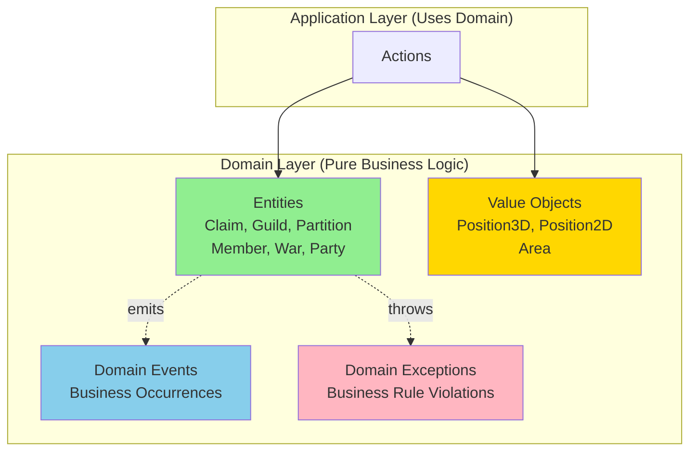
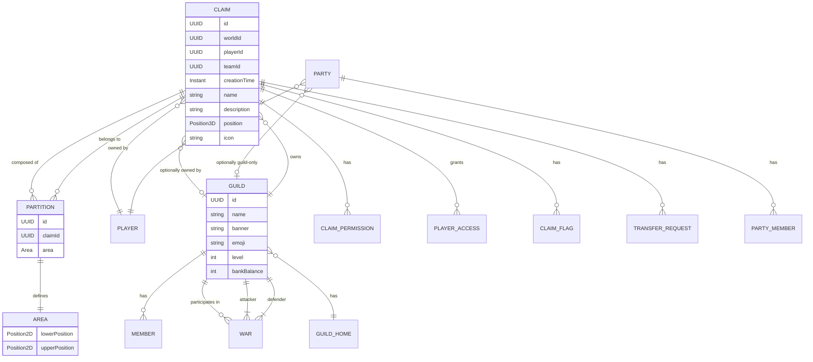
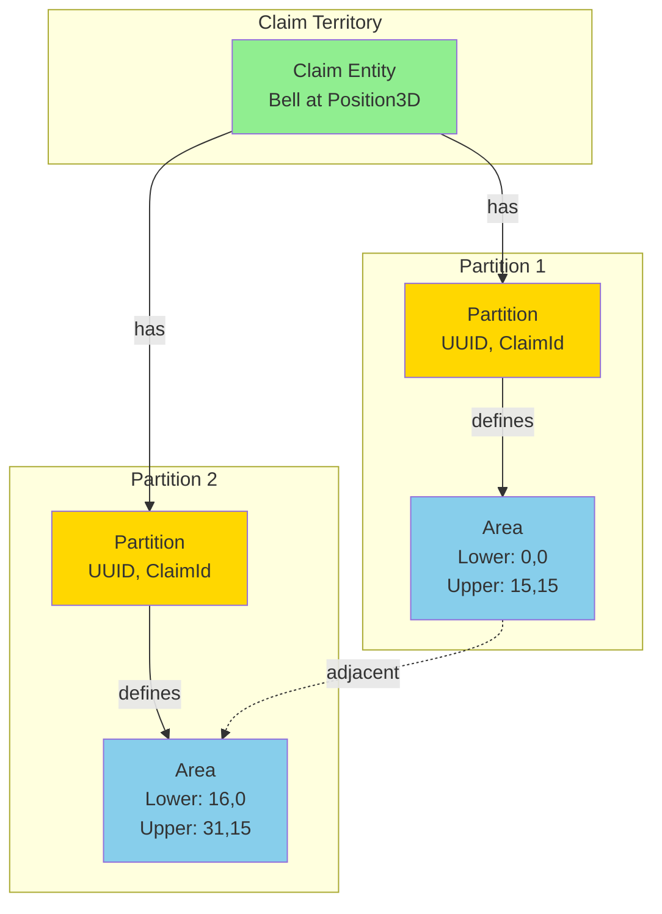
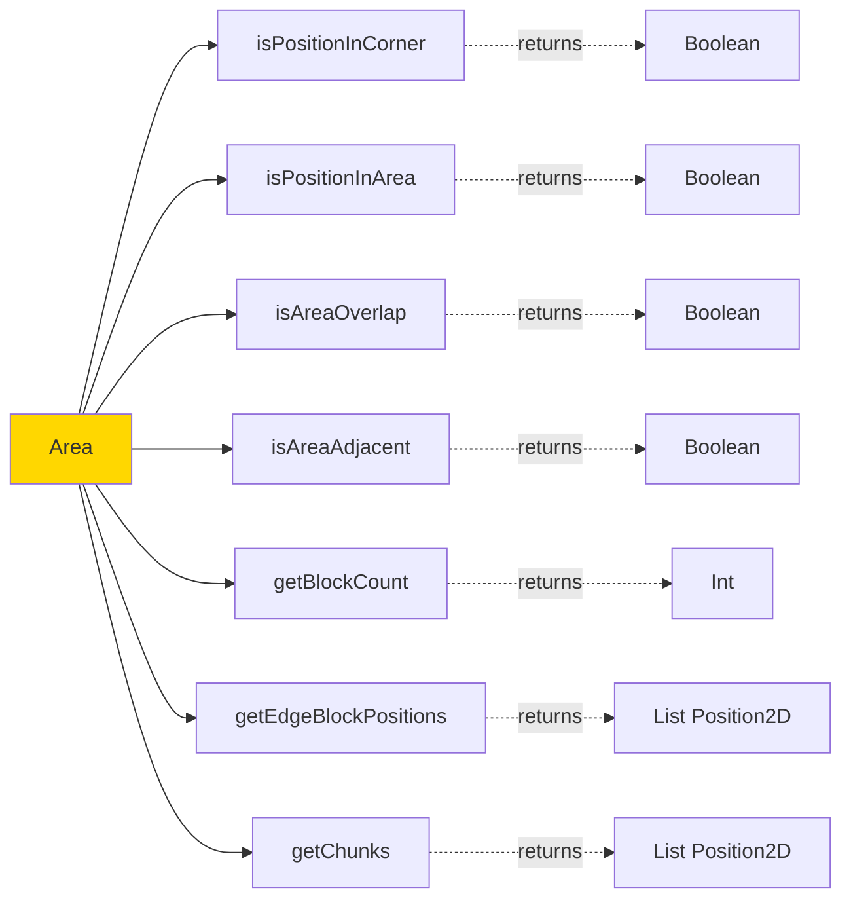

# Domain Layer Documentation

The domain layer (`net.lumalyte.lg.domain`) contains the core business logic of LumaGuilds. This layer has **zero external dependencies** and represents the heart of the application's business rules.

## Domain Layer Overview



## Core Domain Model Relationships



## Philosophy

The domain layer follows Domain-Driven Design (DDD) principles:
- **Entities** have identity and lifecycle
- **Value Objects** are immutable and defined by their attributes
- **Domain Events** capture important business occurrences
- **Domain Exceptions** represent business rule violations

**Key Principle**: The domain layer must remain pure - no dependencies on Bukkit, databases, or any external frameworks.

## Package Structure

```
net.lumalyte.lg.domain
├── entities/       # Objects with identity and lifecycle
├── values/         # Immutable value objects
├── events/         # Domain events
└── exceptions/     # Domain-specific exceptions
```

## Entities

Entities are objects with unique identity that persist over time. They contain business logic and enforce invariants.

### Claim

The core entity representing a player's protected land area.

```kotlin
package net.lumalyte.lg.domain.entities

data class Claim(
    var id: UUID,
    var worldId: UUID,
    var playerId: UUID,
    var teamId: UUID?,          // Null for personal claims
    val creationTime: Instant,
    val name: String,
    val description: String,
    val position: Position3D,   // Bell anchor position
    val icon: String            // Material name for GUI icon
) {
    init {
        // Business rules enforced
        require(name.length in 1..50) {
            "Name must be between 1 and 50 characters."
        }
        require(description.length <= 300) {
            "Description cannot exceed 300 characters."
        }
    }

    // Break protection mechanism
    var breakCount = 3
    private val defaultBreakCount = 3
    private var breakPeriod = false

    // Transfer requests: UUID -> expiry timestamp
    var transferRequests: HashMap<UUID, Int> = HashMap()

    /**
     * Resets the break count after cooldown period.
     * Prevents accidental claim deletion.
     */
    fun resetBreakCount() {
        if (!breakPeriod) {
            thread(start = true) {
                breakPeriod = true
                Thread.sleep(10000)
                breakCount = defaultBreakCount
                breakPeriod = false
            }
        }
    }
}
```

**Usage Example:**
```kotlin
// Creating a new claim
val claim = Claim(
    worldId = world.uniqueId,
    playerId = player.uniqueId,
    teamId = null,  // Personal claim
    position = Position3D(x, y, z),
    name = "My Base"
)

// Validating claim properties
try {
    val invalidClaim = Claim(/* ... */, name = "")  // Throws IllegalArgumentException
} catch (e: IllegalArgumentException) {
    // Handle validation failure
}
```

**Key Properties:**
- `id`: Unique identifier (auto-generated if using secondary constructor)
- `worldId`: Which Minecraft world the claim exists in
- `playerId`: Owner's UUID
- `teamId`: Guild UUID if converted to guild claim, null otherwise
- `position`: Location of the Bell anchor block
- `name`: Player-visible claim name (1-50 chars)
- `description`: Optional description (max 300 chars)
- `icon`: Material name for GUI representation

### Partition

Defines a rectangular area that makes up part or all of a claim. Claims can have multiple non-contiguous partitions.

```kotlin
package net.lumalyte.lg.domain.entities

data class Partition(
    val id: UUID,
    val claimId: UUID,
    val area: Area  // Value object defining rectangle
) {
    // Convenience constructor
    constructor(claimId: UUID, area: Area) :
        this(UUID.randomUUID(), claimId, area)

    /**
     * Checks if a position is within this partition.
     */
    fun isPositionInPartition(position: Position): Boolean {
        return area.isPositionInArea(position)
    }

    /**
     * Checks if this partition is adjacent to another.
     */
    fun isPartitionAdjacent(partition: Partition): Boolean {
        return area.isAreaAdjacent(partition.area)
    }

    /**
     * Checks if partition is linked (adjacent + same claim).
     */
    fun isPartitionLinked(partition: Partition): Boolean {
        return isPartitionAdjacent(partition) &&
               partition.claimId == claimId
    }

    /**
     * Gets list of chunks this partition occupies.
     */
    fun getChunks(): ArrayList<Position2D> {
        val firstChunk = area.lowerPosition2D.getChunk()
        val secondChunk = area.upperPosition2D.getChunk()

        val chunks = ArrayList<Position2D>()
        for (x in firstChunk.x..secondChunk.x) {
            for (z in firstChunk.z..secondChunk.z) {
                chunks.add(Position2D(x, z))
            }
        }
        return chunks
    }

    /**
     * Calculates total block count in partition.
     */
    fun getBlockCount(): Int = area.getBlockCount()
}
```

**Usage Example:**
```kotlin
// Creating a partition for a new claim
val initialArea = Area(
    Position2D(x - 7, z - 7),
    Position2D(x + 7, z + 7)  // 15x15 default
)
val partition = Partition(claimId, initialArea)

// Checking if player is in partition
if (partition.isPositionInPartition(playerPosition)) {
    // Player is within this partition
}

// Finding chunks to update
val affectedChunks = partition.getChunks()
// Update chunk cache for each chunk
```

**Builder Pattern:**
```kotlin
// Creating partition with builder
val builder = Partition.Builder(claimId, firstCorner)
builder.secondPosition2D = secondCorner
val partition = builder.build()
```

**Resizer Pattern:**
```kotlin
// Resizing existing partition
val resizer = Partition.Resizer(partition, cornerToMove)
resizer.setNewCorner(newCornerPosition)

val extraBlocks = resizer.getExtraBlockCount()
if (playerHasEnoughBlocks(extraBlocks)) {
    val resizedPartition = Partition(
        partition.id,
        partition.claimId,
        resizer.newArea
    )
}
```

### Guild

Represents a player organization with shared resources and territory.

```kotlin
package net.lumalyte.lg.domain.entities

data class Guild(
    val id: UUID,
    val name: String,
    val banner: String? = null,          // Serialized ItemStack
    val emoji: String? = null,            // ":emojiname:" format
    val tag: String? = null,              // MiniMessage formatted
    val description: String? = null,
    val homes: GuildHomes = GuildHomes.EMPTY,
    val level: Int = 1,
    val bankBalance: Int = 0,
    val mode: GuildMode = GuildMode.HOSTILE,
    val modeChangedAt: Instant? = null,
    val createdAt: Instant,
    val vaultChestLocation: GuildVaultLocation? = null,
    val vaultStatus: VaultStatus = VaultStatus.NEVER_PLACED,
    val vaultLocked: Boolean = false
) {
    init {
        // Business invariants
        require(name.length in 1..32) {
            "Guild name must be between 1 and 32 characters."
        }
        require(level > 0) {
            "Guild level must be positive."
        }
        require(bankBalance >= 0) {
            "Guild bank balance cannot be negative."
        }

        // Validate emoji format (Nexo placeholder)
        emoji?.let { emojiValue ->
            require(emojiValue.startsWith(":") &&
                    emojiValue.endsWith(":") &&
                    emojiValue.length > 2) {
                "Guild emoji must be valid Nexo placeholder (e.g., ':catsmileysmile:')"
            }
        }

        description?.let { descValue ->
            require(descValue.length <= 100) {
                "Guild description must be 100 characters or less."
            }
        }
    }
}

enum class GuildMode {
    PEACEFUL,  // Cannot declare war
    HOSTILE    // Can participate in wars
}

enum class VaultStatus {
    NEVER_PLACED,
    ACTIVE,
    DESTROYED
}

data class GuildHome(
    val worldId: UUID,
    val position: Position3D
)

data class GuildHomes(
    val defaultHome: GuildHome?,
    val additionalHomes: Map<String, GuildHome> = emptyMap()
) {
    companion object {
        val EMPTY = GuildHomes(null, emptyMap())
    }
}
```

**Usage Example:**
```kotlin
// Creating a new guild
val guild = Guild(
    id = UUID.randomUUID(),
    name = "Dragon Slayers",
    createdAt = Instant.now(),
    emoji = ":dragon:",
    tag = "<gradient:#FF0000:#00FF00>DS</gradient>",
    mode = GuildMode.HOSTILE
)

// Setting guild home
val updatedGuild = guild.copy(
    homes = GuildHomes(
        defaultHome = GuildHome(worldId, Position3D(x, y, z))
    )
)

// Leveling up guild
val leveledGuild = guild.copy(level = guild.level + 1)
```

### Member

Represents a player's membership in a guild.

```kotlin
package net.lumalyte.lg.domain.entities

data class Member(
    val guildId: UUID,
    val playerId: UUID,
    val joinedAt: Instant,
    val contributedMoney: Int = 0
)

// Usage
val member = Member(
    guildId = guild.id,
    playerId = player.uniqueId,
    joinedAt = Instant.now()
)
```

### War

Represents a conflict between two guilds.

```kotlin
package net.lumalyte.lg.domain.entities

data class War(
    val id: UUID,
    val attackingGuildId: UUID,
    val defendingGuildId: UUID,
    val declaredAt: Instant,
    val wager: Int,              // Virtual currency amount
    val objectives: WarObjectives
)

data class WarObjectives(
    val killsToWin: Int,
    val timeLimit: Duration?
)
```

### Party

Temporary player groups for coordinated gameplay.

```kotlin
package net.lumalyte.lg.domain.entities

data class Party(
    val id: UUID,
    val leaderId: UUID,
    val guildId: UUID?,         // Null for public parties
    val createdAt: Instant,
    val isPublic: Boolean
)
```

## Value Objects

Value objects are immutable and defined entirely by their attributes - they have no identity.

### Position3D

Three-dimensional world coordinates.

```kotlin
package net.lumalyte.lg.domain.values

data class Position3D(val x: Int, val y: Int, val z: Int)

// Usage
val bellPosition = Position3D(100, 64, -200)
val above = Position3D(bellPosition.x, bellPosition.y + 1, bellPosition.z)
```

### Position2D

Two-dimensional coordinates (X and Z) used for area definitions.

```kotlin
package net.lumalyte.lg.domain.values

data class Position2D(val x: Int, val z: Int) {
    /**
     * Converts block position to chunk position.
     */
    fun getChunk(): Position2D {
        return Position2D(x shr 4, z shr 4)
    }
}

// Usage
val blockPos = Position2D(127, -34)
val chunkPos = blockPos.getChunk()  // Position2D(7, -3)
```

### Area

Defines a rectangular region with two corner positions.

**Area Composition Diagram:**



**Area Validation Methods:**



```kotlin
package net.lumalyte.lg.domain.values

data class Area(
    var lowerPosition2D: Position2D,
    var upperPosition2D: Position2D
) {
    init {
        sortPositionSizes()  // Ensures lower < upper
    }

    /**
     * Checks if position is in a corner of the area.
     */
    fun isPositionInCorner(position2D: Position2D): Boolean {
        if (position2D == lowerPosition2D || position2D == upperPosition2D) {
            return true
        }
        if (position2D == Position2D(lowerPosition2D.x, upperPosition2D.z)) {
            return true
        }
        if (position2D == Position2D(upperPosition2D.x, lowerPosition2D.z)) {
            return true
        }
        return false
    }

    /**
     * Checks if position is within area bounds.
     */
    fun isPositionInArea(position: Position): Boolean {
        return (position.x >= lowerPosition2D.x &&
                position.x <= upperPosition2D.x &&
                position.z >= lowerPosition2D.z &&
                position.z <= upperPosition2D.z)
    }

    /**
     * Checks if another area overlaps this one.
     */
    fun isAreaOverlap(area: Area): Boolean {
        return lowerPosition2D.x <= area.upperPosition2D.x &&
               upperPosition2D.x >= area.lowerPosition2D.x &&
               lowerPosition2D.z <= area.upperPosition2D.z &&
               upperPosition2D.z >= area.lowerPosition2D.z
    }

    /**
     * Checks if area is directly adjacent (touching edges).
     */
    fun isAreaAdjacent(area: Area): Boolean {
        // Check all four edges for adjacency
        // Top, Bottom, Left, Right edge checks...
    }

    /**
     * Calculates total blocks in area.
     */
    fun getBlockCount(): Int {
        return ((upperPosition2D.x - lowerPosition2D.x + 1) *
                (upperPosition2D.z - lowerPosition2D.z + 1)).absoluteValue
    }

    /**
     * Gets all edge block positions (perimeter).
     */
    fun getEdgeBlockPositions(): ArrayList<Position2D> {
        val blocks = ArrayList<Position2D>()
        // Add all perimeter blocks
        for (x in lowerPosition2D.x..upperPosition2D.x) {
            blocks.add(Position2D(x, lowerPosition2D.z))
            blocks.add(Position2D(x, upperPosition2D.z))
        }
        for (z in lowerPosition2D.z..upperPosition2D.z) {
            blocks.add(Position2D(lowerPosition2D.x, z))
            blocks.add(Position2D(upperPosition2D.x, z))
        }
        return blocks
    }
}
```

**Usage Example:**
```kotlin
// Define claim area
val area = Area(
    Position2D(0, 0),
    Position2D(15, 15)
)

// Check if player is in area
if (area.isPositionInArea(playerPosition)) {
    // Player is in claimed area
}

// Check for overlapping claims
val newArea = Area(Position2D(10, 10), Position2D(25, 25))
if (existingArea.isAreaOverlap(newArea)) {
    // Cannot create claim - overlaps existing
}

// Calculate claim size
val blocks = area.getBlockCount()  // 256 blocks
```

## Domain Events

Events that represent important occurrences in the domain.

```kotlin
package net.lumalyte.lg.domain.events

// Example domain event
data class ClaimCreatedEvent(
    val claimId: UUID,
    val playerId: UUID,
    val timestamp: Instant
)

data class GuildWarDeclaredEvent(
    val warId: UUID,
    val attackingGuildId: UUID,
    val defendingGuildId: UUID,
    val timestamp: Instant
)
```

## Domain Exceptions

Exceptions representing business rule violations.

```kotlin
package net.lumalyte.lg.domain.exceptions

class IncompletePartitionBuilderException(message: String) :
    Exception(message)

class InvalidClaimNameException(message: String) :
    IllegalArgumentException(message)

class InsufficientClaimBlocksException(
    val required: Int,
    val available: Int
) : Exception("Requires $required blocks but only $available available")
```

**Usage Example:**
```kotlin
// Domain validates and throws
fun createPartition(builder: Partition.Builder): Partition {
    if (!builder::secondPosition2D.isInitialized) {
        throw IncompletePartitionBuilderException(
            "Builder requires a filled second position."
        )
    }
    return builder.build()
}

// Application layer catches and converts to Result
fun execute(/* ... */): CreateClaimResult {
    try {
        val partition = createPartition(builder)
        return CreateClaimResult.Success(partition)
    } catch (e: IncompletePartitionBuilderException) {
        return CreateClaimResult.InvalidSelection
    }
}
```

## Domain Invariants

Business rules enforced by the domain layer:

### Claim Invariants
- Name must be 1-50 characters
- Description cannot exceed 300 characters
- Claims must have at least one partition
- Partitions cannot overlap within same world
- Break count resets after 10-second cooldown

### Guild Invariants
- Name must be 1-32 characters
- Level must be positive
- Bank balance cannot be negative
- Emoji must be Nexo placeholder format (`:name:`)
- Description max 100 characters
- Mode change cooldowns enforced elsewhere

### Partition Invariants
- Area positions automatically sorted (lower < upper)
- Partition must have positive area
- Adjacent partitions of same claim can be merged

## Testing Domain Logic

Domain objects are easy to test due to zero external dependencies:

```kotlin
class ClaimTest {
    @Test
    fun `should enforce name length constraints`() {
        assertThrows<IllegalArgumentException> {
            Claim(
                worldId = UUID.randomUUID(),
                playerId = UUID.randomUUID(),
                position = Position3D(0, 0, 0),
                name = ""  // Too short
            )
        }

        assertThrows<IllegalArgumentException> {
            Claim(/* ... */, name = "a".repeat(51))  // Too long
        }
    }

    @Test
    fun `area should calculate block count correctly`() {
        val area = Area(
            Position2D(0, 0),
            Position2D(9, 9)
        )
        assertEquals(100, area.getBlockCount())
    }
}
```

## Best Practices

1. **Keep domain pure**: Never import Bukkit, database, or framework code
2. **Validate in constructors**: Use `init` blocks and `require()` for invariants
3. **Use value objects**: Prefer `Position3D` over raw x/y/z parameters
4. **Immutable where possible**: Use `val` for properties that shouldn't change
5. **Rich domain model**: Put business logic in entities, not services
6. **Named constructors**: Use secondary constructors for common creation patterns

```kotlin
// Good: Rich domain model
class Claim {
    fun canBeTransferredTo(playerId: UUID): Boolean {
        return !transferRequests.containsKey(playerId) ||
               transferRequests[playerId]!! < currentTime()
    }
}

// Bad: Anemic domain model
// (Logic in service instead of entity)
class ClaimService {
    fun canTransferClaim(claim: Claim, playerId: UUID): Boolean {
        // Business logic outside domain...
    }
}
```

## Related Documentation

- [Application Layer](./application.md) - How to use domain entities in use cases
- [Architecture Overview](./architecture.md) - Understanding the layered design
- [Infrastructure Layer](./infrastructure.md) - Persisting domain entities
