# Getting Started Guide

This guide will help you understand how to work with the LumaGuilds codebase, add new features, and extend functionality.

## Development Workflow

```mermaid
flowchart LR
    Start([New Feature Request]) --> Define[Define Requirements]
    Define --> Design[Design Solution]
    Design --> Domain{Changes Domain?}

    Domain -->|Yes| UpdateDomain[Update Domain Entities]
    Domain -->|No| SkipDomain[Use Existing Domain]

    UpdateDomain --> CreateAction[Create Application Action]
    SkipDomain --> CreateAction

    CreateAction --> DefineResult[Define Result Type]
    DefineResult --> CreateRepo{Need Persistence?}

    CreateRepo -->|Yes| ImplRepo[Implement Repository]
    CreateRepo -->|No| SkipRepo[Skip Persistence]

    ImplRepo --> AddInteraction[Add Interaction Layer]
    SkipRepo --> AddInteraction

    AddInteraction --> Test[Write Tests]
    Test --> Integrate[Wire with Koin DI]
    Integrate --> Done([Feature Complete])

    style UpdateDomain fill:#90EE90
    style CreateAction fill:#87CEEB
    style ImplRepo fill:#FFD700
    style AddInteraction fill:#FFB6C1
```



## Project Setup

### Prerequisites

- **JDK 21** or higher
- **Gradle** 8.x (included via wrapper)
- **Git**
- **IDE**: IntelliJ IDEA recommended

### Clone and Build

```bash
git clone https://github.com/your-org/bell-claims.git
cd bell-claims
./gradlew build
```

### Run Tests

```bash
./gradlew test
```

### Generate JAR

```bash
./gradlew shadowJar
# Output: build/libs/LumaGuilds-[version].jar
```

## Understanding the Codebase

### Directory Structure

```
bell-claims/
├── src/main/kotlin/net/lumalyte/lg/
│   ├── domain/              # Core business logic (no dependencies)
│   │   ├── entities/
│   │   ├── values/
│   │   ├── events/
│   │   └── exceptions/
│   ├── application/         # Use cases and ports
│   │   ├── actions/
│   │   ├── results/
│   │   ├── persistence/    # Repository interfaces
│   │   └── events/
│   ├── infrastructure/      # External concerns
│   │   ├── persistence/    # Repository implementations
│   │   ├── adapters/       # Bukkit adapters
│   │   ├── listeners/      # Event handlers
│   │   └── services/
│   ├── interaction/         # Player-facing layer
│   │   ├── commands/
│   │   ├── menus/
│   │   └── listeners/
│   ├── config/             # Configuration
│   └── di/                 # Dependency injection
├── docs/                   # Documentation
└── build.gradle.kts
```

## Adding a New Feature

Let's walk through adding a complete feature: **Allow players to set custom claim icons**.

### Step 1: Define the Requirement

**Feature**: Players can change their claim's icon to any material they're holding.

**Acceptance Criteria**:
- Command: `/claim seticon`
- Player must be in their claim
- Must be holding a valid item
- Updates claim icon in database
- Updates GUI displays

### Step 2: Check Domain Layer

**Question**: Do we need to modify domain entities?

```kotlin
// Check Claim entity
data class Claim(
    // ...
    val icon: String  // ✅ Already exists! No domain changes needed
)
```

**Answer**: No domain changes needed - icon field already exists!

### Step 3: Create Application Action

Create a new action in `application/actions/claim/metadata/`:

```kotlin
// File: UpdateClaimIcon.kt
package net.lumalyte.lg.application.actions.claim.metadata

class UpdateClaimIcon(
    private val claimRepository: ClaimRepository
) {
    fun execute(claimId: UUID, newIcon: String): UpdateClaimIconResult {
        // 1. Get claim
        val claim = claimRepository.getById(claimId)
            ?: return UpdateClaimIconResult.ClaimNotFound

        // 2. Validate icon is a valid material
        if (!isValidMaterial(newIcon)) {
            return UpdateClaimIconResult.InvalidMaterial
        }

        // 3. Update claim
        val updatedClaim = claim.copy(icon = newIcon)
        claimRepository.update(updatedClaim)

        return UpdateClaimIconResult.Success(updatedClaim)
    }

    private fun isValidMaterial(materialName: String): Boolean {
        return try {
            Material.valueOf(materialName)
            true
        } catch (e: IllegalArgumentException) {
            false
        }
    }
}
```

### Step 4: Define Result Type

Create result sealed class:

```kotlin
// File: UpdateClaimIconResult.kt
package net.lumalyte.lg.application.results.claim.metadata

sealed class UpdateClaimIconResult {
    data class Success(val claim: Claim) : UpdateClaimIconResult()
    object ClaimNotFound : UpdateClaimIconResult()
    object InvalidMaterial : UpdateClaimIconResult()
}
```

### Step 5: Add to Dependency Injection

Wire the action in the DI module:

```kotlin
// File: di/ApplicationModule.kt
val applicationModule = module {
    // ... existing actions ...

    factory { UpdateClaimIcon(get()) }
}
```

### Step 6: Create Command

Add command to handle player input:

```kotlin
// File: interaction/commands/SetIconCommand.kt
package net.lumalyte.lg.interaction.commands

@CommandAlias("claim")
class ClaimCommand : BaseCommand(), KoinComponent {
    private val updateClaimIcon: UpdateClaimIcon by inject()
    private val getPartitionByPosition: GetPartitionByPosition by inject()
    // ... other injections ...

    @Subcommand("seticon")
    @CommandPermission("lumaguilds.command.claim.seticon")
    @Description("Set claim icon to item in hand")
    fun onSetIcon(player: Player) {
        // 1. Check player is holding an item
        val itemInHand = player.inventory.itemInMainHand
        if (itemInHand.type == Material.AIR) {
            player.sendMessage("§cYou must be holding an item!")
            return
        }

        // 2. Get partition at player position
        val partition = getPartitionByPosition.execute(
            player.location.toPosition3D(),
            player.world.uid
        ) ?: run {
            player.sendMessage("§cYou must be in a claim!")
            return
        }

        // 3. Execute action
        when (val result = updateClaimIcon.execute(
            partition.claimId,
            itemInHand.type.name
        )) {
            is UpdateClaimIconResult.Success -> {
                player.sendMessage("§aClaim icon updated to ${itemInHand.type.name}!")
            }
            UpdateClaimIconResult.ClaimNotFound -> {
                player.sendMessage("§cClaim not found!")
            }
            UpdateClaimIconResult.InvalidMaterial -> {
                player.sendMessage("§cInvalid item!")
            }
        }
    }
}
```

### Step 7: Test the Feature

Create unit tests:

```kotlin
// File: test/kotlin/application/actions/UpdateClaimIconTest.kt
class UpdateClaimIconTest {
    private lateinit var mockRepository: ClaimRepository
    private lateinit var updateClaimIcon: UpdateClaimIcon

    @BeforeEach
    fun setup() {
        mockRepository = mockk()
        updateClaimIcon = UpdateClaimIcon(mockRepository)
    }

    @Test
    fun `should update icon when claim exists and material valid`() {
        // Arrange
        val claim = Claim(/* ... */, icon = "BELL")
        every { mockRepository.getById(claim.id) } returns claim
        every { mockRepository.update(any()) } just Runs

        // Act
        val result = updateClaimIcon.execute(claim.id, "DIAMOND")

        // Assert
        assertTrue(result is UpdateClaimIconResult.Success)
        verify { mockRepository.update(match { it.icon == "DIAMOND" }) }
    }

    @Test
    fun `should return ClaimNotFound when claim doesn't exist`() {
        // Arrange
        every { mockRepository.getById(any()) } returns null

        // Act
        val result = updateClaimIcon.execute(UUID.randomUUID(), "DIAMOND")

        // Assert
        assertEquals(UpdateClaimIconResult.ClaimNotFound, result)
    }

    @Test
    fun `should return InvalidMaterial for invalid material name`() {
        // Arrange
        val claim = Claim(/* ... */)
        every { mockRepository.getById(claim.id) } returns claim

        // Act
        val result = updateClaimIcon.execute(claim.id, "INVALID_MATERIAL")

        // Assert
        assertEquals(UpdateClaimIconResult.InvalidMaterial, result)
    }
}
```

### Feature Complete!


## Common Development Tasks

### Adding a New Domain Entity


Example - Adding a "ClaimTag" entity:

```kotlin
// 1. Domain Entity
package net.lumalyte.lg.domain.entities

data class ClaimTag(
    val id: UUID,
    val claimId: UUID,
    val tag: String,
    val color: String
) {
    init {
        require(tag.length in 1..20) { "Tag must be 1-20 characters" }
        require(color.matches(Regex("#[0-9A-Fa-f]{6}"))) {
            "Color must be hex format"
        }
    }
}

// 2. Repository Interface
package net.lumalyte.lg.application.persistence

interface ClaimTagRepository {
    fun add(tag: ClaimTag)
    fun remove(tagId: UUID)
    fun getByClaimId(claimId: UUID): List<ClaimTag>
}

// 3. Repository Implementation
package net.lumalyte.lg.infrastructure.persistence.claims

class ClaimTagRepositorySQLite(
    private val storage: Storage<Database>
) : ClaimTagRepository {
    init {
        createTable()
    }

    override fun add(tag: ClaimTag) {
        storage.connection.executeUpdate(
            "INSERT INTO claim_tags (id, claim_id, tag, color) VALUES (?,?,?,?);",
            tag.id, tag.claimId, tag.tag, tag.color
        )
    }

    private fun createTable() {
        storage.connection.executeUpdate("""
            CREATE TABLE IF NOT EXISTS claim_tags (
                id VARCHAR(36) PRIMARY KEY,
                claim_id VARCHAR(36) NOT NULL,
                tag VARCHAR(20) NOT NULL,
                color VARCHAR(7) NOT NULL,
                FOREIGN KEY (claim_id) REFERENCES claims(id) ON DELETE CASCADE
            );
        """)
    }

    // ... other methods
}
```

### Adding a New Action

Template for creating actions:

```kotlin
package net.lumalyte.lg.application.actions.[domain]

class [ActionName](
    private val [repository]: [RepositoryType],
    // ... other dependencies
) {
    fun execute([parameters]): [ResultType] {
        // 1. Validate input
        // 2. Get required entities from repositories
        // 3. Apply business logic
        // 4. Persist changes
        // 5. Return result
    }
}

// Corresponding result
sealed class [ActionName]Result {
    data class Success([data]) : [ActionName]Result()
    object [FailureReason1] : [ActionName]Result()
    object [FailureReason2] : [ActionName]Result()
}
```

### Adding a New GUI Menu

```kotlin
package net.lumalyte.lg.interaction.menus.[category]

class [MenuName](
    private val [data]: [DataType],
    private val [action1]: [Action1],
    private val menuNavigator: MenuNavigator
) : Menu {

    override fun open(player: Player) {
        val inventory = Bukkit.createInventory(
            null,
            [size],  // Must be multiple of 9
            "[Title]"
        )

        // Add items
        inventory.setItem([slot], ItemStack(Material.[TYPE]).apply {
            itemMeta = itemMeta?.apply {
                setDisplayName("[Display Name]")
                lore = listOf("[Description]")
            }
        })

        player.openInventory(inventory)
    }

    override fun handleClick(player: Player, slot: Int, clickType: ClickType) {
        when (slot) {
            [slot] -> {
                // Handle click
                val result = [action].execute(/* ... */)
                when (result) {
                    is [Result].Success -> {
                        player.sendMessage("Success!")
                        refresh(player)
                    }
                    // ... handle other results
                }
            }
        }
    }

    override fun refresh(player: Player) {
        open(player)
    }

    override fun close(player: Player) {
        player.closeInventory()
    }
}
```

## Testing Guidelines

### Unit Testing Actions

```kotlin
class [ActionName]Test {
    private lateinit var mock[Repository]: [RepositoryType]
    private lateinit var [action]: [ActionName]

    @BeforeEach
    fun setup() {
        mock[Repository] = mockk()
        [action] = [ActionName](mock[Repository])
    }

    @Test
    fun `should succeed when [condition]`() {
        // Arrange
        every { mock[Repository].[method](any()) } returns [data]

        // Act
        val result = [action].execute([params])

        // Assert
        assertTrue(result is [Result].Success)
        verify { mock[Repository].[method](any()) }
    }

    @Test
    fun `should fail when [condition]`() {
        // Arrange
        every { mock[Repository].[method](any()) } returns null

        // Act
        val result = [action].execute([params])

        // Assert
        assertEquals([Result].[FailureCase], result)
    }
}
```

## Debugging Tips

### Enable Debug Logging

```kotlin
// Add to config
debug: true

// In code
if (config.debug) {
    plugin.logger.info("Debug: $variable")
}
```

### Common Issues

**Issue**: Action not found by Koin
**Solution**: Ensure action is registered in DI module

**Issue**: Database table doesn't exist
**Solution**: Check `createTable()` is called in repository `init`

**Issue**: Command not working
**Solution**: Verify `@CommandPermission` and command is registered

## Related Documentation

- [Architecture Overview](./architecture.md) - Understanding the system design
- [Domain Layer](./domain.md) - Creating entities and value objects
- [Application Layer](./application.md) - Writing actions and results
- [Infrastructure Layer](./infrastructure.md) - Implementing repositories
- [Interaction Layer](./interaction.md) - Creating commands and menus
- [Integration Guide](./integration.md) - Advanced integration patterns
