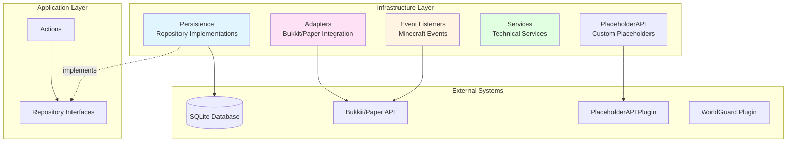
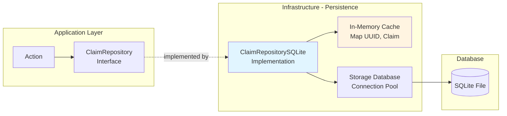
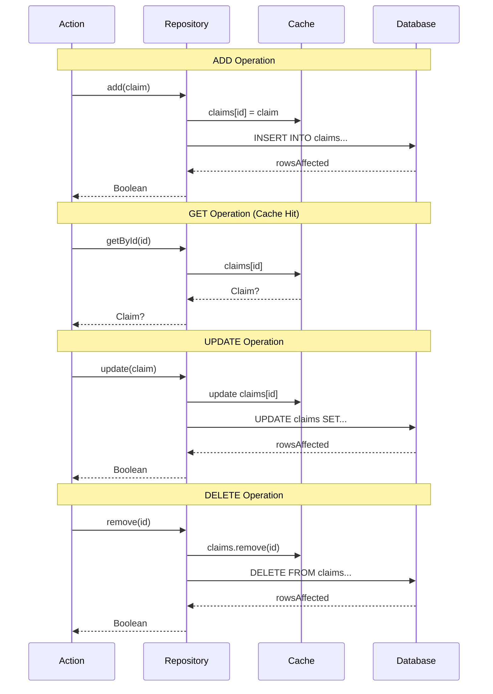
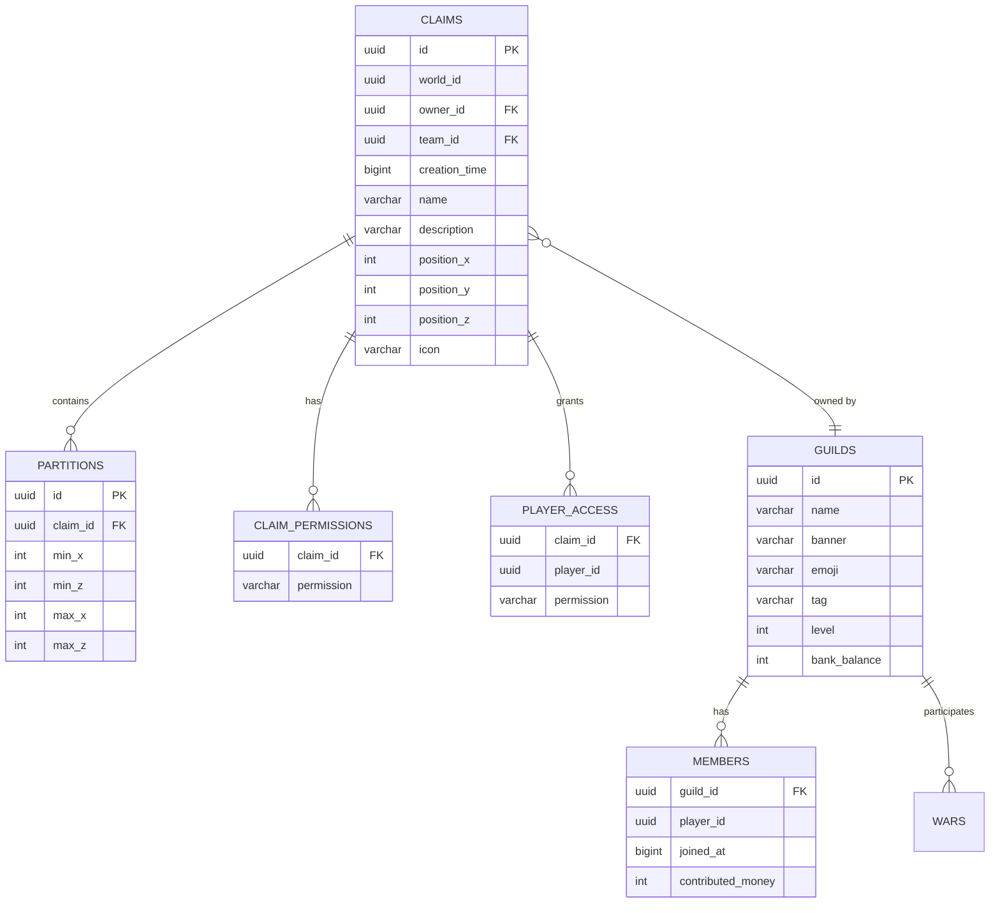
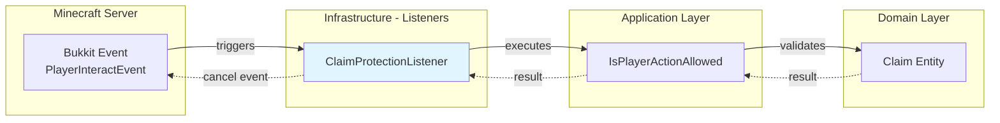
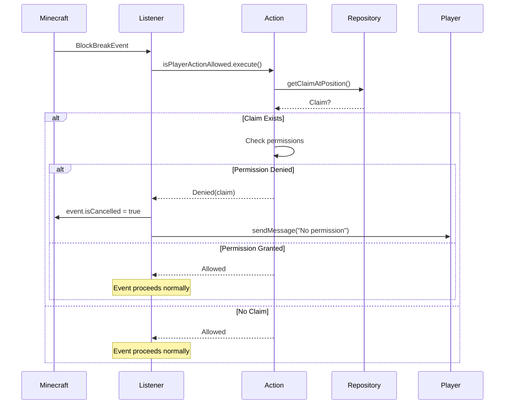

# Infrastructure Layer Documentation

The infrastructure layer (`net.lumalyte.lg.infrastructure`) implements the interfaces defined by the application layer and handles all external concerns like databases, Minecraft server integration, and third-party plugins.

## Layer Overview



## Package Structure

```
net.lumalyte.lg.infrastructure
├── persistence/           # Database implementations
│   ├── claims/
│   │   ├── ClaimRepositorySQLite.kt
│   │   ├── ClaimPermissionRepositorySQLite.kt
│   │   └── ClaimFlagRepositorySQLite.kt
│   ├── guilds/
│   ├── partitions/
│   ├── players/
│   ├── storage/          # Database connection management
│   └── migrations/       # Database schema migrations
├── adapters/             # Framework adapters
│   └── bukkit/
│       ├── BukkitLocationAdapter.kt
│       └── BukkitItemStackAdapter.kt
├── listeners/            # Minecraft event handlers
├── services/             # Technical services
│   └── scheduling/
├── placeholders/         # PlaceholderAPI integration
├── namespaces/           # Custom NamespacedKeys
├── utilities/            # Helper utilities
└── hidden/               # Internal implementation details
```

## Persistence Layer

The persistence layer implements repository interfaces using SQLite with an in-memory cache for performance.

### Persistence Architecture



### ClaimRepositorySQLite

Implements claim persistence with dual-layer caching strategy.

```kotlin
package net.lumalyte.lg.infrastructure.persistence.claims

class ClaimRepositorySQLite(
    private val storage: Storage<Database>
) : ClaimRepository {

    // In-memory cache for fast reads
    private val claims: MutableMap<UUID, Claim> = mutableMapOf()

    init {
        createClaimTable()
        preload()  // Load all claims into cache on startup
    }

    override fun add(claim: Claim): Boolean {
        // 1. Add to cache
        claims[claim.id] = claim

        // 2. Persist to database
        try {
            val rowsAffected = storage.connection.executeUpdate(
                """INSERT INTO claims (id, world_id, owner_id, team_id,
                   creation_time, name, description, position_x,
                   position_y, position_z, icon)
                   VALUES (?,?,?,?,?,?,?,?,?,?,?);""",
                claim.id, claim.worldId, claim.playerId, claim.teamId,
                claim.creationTime, claim.name, claim.description,
                claim.position.x, claim.position.y, claim.position.z,
                claim.icon
            )
            return rowsAffected > 0
        } catch (error: SQLException) {
            throw DatabaseOperationException(
                "Failed to add claim '${claim.name}' to the database. " +
                "Cause: ${error.message}",
                error
            )
        }
    }

    override fun update(claim: Claim): Boolean {
        // Update cache
        claims.remove(claim.id)
        claims[claim.id] = claim

        // Update database
        try {
            val rowsAffected = storage.connection.executeUpdate(
                """UPDATE claims SET world_id=?, owner_id=?, team_id=?,
                   creation_time=?, name=?, description=?, position_x=?,
                   position_y=?, position_z=?, icon=? WHERE id=?;""",
                claim.worldId, claim.playerId, claim.teamId,
                claim.creationTime, claim.name, claim.description,
                claim.position.x, claim.position.y, claim.position.z,
                claim.icon, claim.id
            )
            return rowsAffected > 0
        } catch (error: SQLException) {
            throw DatabaseOperationException(
                "Failed to update claim '${claim.name}' in the database. " +
                "Cause: ${error.message}",
                error
            )
        }
    }

    override fun remove(claimId: UUID): Boolean {
        // Remove from cache
        claims.remove(claimId)

        // Remove from database
        try {
            val rowsAffected = storage.connection.executeUpdate(
                "DELETE FROM claims WHERE id=?;",
                claimId
            )
            return rowsAffected > 0
        } catch (error: SQLException) {
            throw DatabaseOperationException(
                "Failed to remove claim '$claimId' from the database. " +
                "Cause: ${error.message}",
                error
            )
        }
    }

    // Fast cache-based queries
    override fun getById(id: UUID): Claim? = claims[id]

    override fun getByPlayer(playerId: UUID): Set<Claim> {
        return claims.values.filter { it.playerId == playerId }.toSet()
    }

    override fun getByName(playerId: UUID, name: String): Claim? {
        return claims.values.firstOrNull { claim ->
            claim.name == name && claim.playerId == playerId
        }
    }

    override fun getAll(): Set<Claim> = claims.values.toSet()

    /**
     * Creates the claims table if it doesn't exist.
     */
    private fun createClaimTable() {
        try {
            storage.connection.executeUpdate(
                """CREATE TABLE IF NOT EXISTS claims (
                    id VARCHAR(36) PRIMARY KEY,
                    world_id VARCHAR(36) NOT NULL,
                    owner_id VARCHAR(36) NOT NULL,
                    team_id VARCHAR(36),
                    creation_time BIGINT NOT NULL,
                    name VARCHAR(50) NOT NULL,
                    description VARCHAR(300),
                    position_x INT NOT NULL,
                    position_y INT NOT NULL,
                    position_z INT NOT NULL,
                    icon VARCHAR(50) NOT NULL
                );"""
            )
        } catch (error: SQLException) {
            throw DatabaseOperationException(
                "Failed to create claims table. Cause: ${error.message}",
                error
            )
        }
    }

    /**
     * Preloads all claims from database into cache.
     */
    private fun preload() {
        try {
            storage.connection.getResults(
                "SELECT * FROM claims;"
            ).forEach { row ->
                val claim = Claim(
                    id = UUID.fromString(row.getString("id")),
                    worldId = UUID.fromString(row.getString("world_id")),
                    playerId = UUID.fromString(row.getString("owner_id")),
                    teamId = row.getString("team_id")?.let { UUID.fromString(it) },
                    creationTime = Instant.ofEpochMilli(row.getLong("creation_time")),
                    name = row.getString("name"),
                    description = row.getString("description"),
                    position = Position3D(
                        row.getInt("position_x"),
                        row.getInt("position_y"),
                        row.getInt("position_z")
                    ),
                    icon = row.getString("icon")
                )
                claims[claim.id] = claim
            }
        } catch (error: SQLException) {
            throw DatabaseOperationException(
                "Failed to preload claims from database. Cause: ${error.message}",
                error
            )
        }
    }
}
```

### Repository CRUD Flow



### ClaimPermissionRepositorySQLite

Handles claim-wide and player-specific permissions.

```kotlin
package net.lumalyte.lg.infrastructure.persistence.claims

class ClaimPermissionRepositorySQLite(
    private val storage: Storage<Database>
) : ClaimPermissionRepository {

    init {
        createClaimPermissionTable()
    }

    override fun addClaimWidePermission(
        claimId: UUID,
        permission: ClaimPermission
    ): Boolean {
        try {
            val rowsAffected = storage.connection.executeUpdate(
                """INSERT OR IGNORE INTO claim_permissions
                   (claim_id, permission) VALUES (?, ?);""",
                claimId, permission.name
            )
            return rowsAffected > 0
        } catch (error: SQLException) {
            throw DatabaseOperationException(
                "Failed to add claim-wide permission. Cause: ${error.message}",
                error
            )
        }
    }

    override fun getClaimWidePermissions(claimId: UUID): Set<ClaimPermission> {
        return try {
            storage.connection.getResults(
                "SELECT permission FROM claim_permissions WHERE claim_id=?;",
                claimId
            ).map { row ->
                ClaimPermission.valueOf(row.getString("permission"))
            }.toSet()
        } catch (error: SQLException) {
            throw DatabaseOperationException(
                "Failed to get claim permissions. Cause: ${error.message}",
                error
            )
        }
    }
}
```

### PlayerAccessRepositorySQLite

Manages player-specific permissions within claims.

```kotlin
package net.lumalyte.lg.infrastructure.persistence.claims

class PlayerAccessRepositorySQLite(
    private val storage: Storage<Database>
) : PlayerAccessRepository {

    override fun add(
        claimId: UUID,
        playerId: UUID,
        permission: ClaimPermission
    ): Boolean {
        try {
            val rowsAffected = storage.connection.executeUpdate(
                """INSERT OR IGNORE INTO player_access
                   (claim_id, player_id, permission) VALUES (?, ?, ?);""",
                claimId, playerId, permission.name
            )
            return rowsAffected > 0
        } catch (error: SQLException) {
            throw DatabaseOperationException(
                "Failed to add player access. Cause: ${error.message}",
                error
            )
        }
    }

    override fun getPlayerPermissions(
        claimId: UUID,
        playerId: UUID
    ): Set<ClaimPermission> {
        return try {
            storage.connection.getResults(
                """SELECT permission FROM player_access
                   WHERE claim_id=? AND player_id=?;""",
                claimId, playerId
            ).map { row ->
                ClaimPermission.valueOf(row.getString("permission"))
            }.toSet()
        } catch (error: SQLException) {
            throw DatabaseOperationException(
                "Failed to get player permissions. Cause: ${error.message}",
                error
            )
        }
    }

    override fun getPlayersWithPermission(
        claimId: UUID,
        permission: ClaimPermission
    ): List<UUID> {
        return try {
            storage.connection.getResults(
                """SELECT player_id FROM player_access
                   WHERE claim_id=? AND permission=?;""",
                claimId, permission.name
            ).map { row ->
                UUID.fromString(row.getString("player_id"))
            }
        } catch (error: SQLException) {
            throw DatabaseOperationException(
                "Failed to get players with permission. Cause: ${error.message}",
                error
            )
        }
    }
}
```

### Database Schema



## Bukkit Adapters

Adapters wrap the Bukkit/Paper API to keep infrastructure concerns isolated.

### BukkitLocationAdapter

Converts between domain Position objects and Bukkit Location.

```kotlin
package net.lumalyte.lg.infrastructure.adapters.bukkit

class BukkitLocationAdapter(private val server: Server) {

    /**
     * Converts domain Position3D to Bukkit Location.
     */
    fun toLocation(position: Position3D, worldId: UUID): Location? {
        val world = server.getWorld(worldId) ?: return null
        return Location(world, position.x.toDouble(), position.y.toDouble(), position.z.toDouble())
    }

    /**
     * Converts Bukkit Location to domain Position3D.
     */
    fun toPosition3D(location: Location): Position3D {
        return Position3D(
            location.blockX,
            location.blockY,
            location.blockZ
        )
    }

    /**
     * Converts Bukkit Location to domain Position2D (ignores Y).
     */
    fun toPosition2D(location: Location): Position2D {
        return Position2D(location.blockX, location.blockZ)
    }
}
```

**Usage Example:**
```kotlin
// In an action or service
class TeleportPlayerToClaimAction(
    private val locationAdapter: BukkitLocationAdapter,
    private val claimRepository: ClaimRepository
) {
    fun execute(playerId: UUID, claimId: UUID) {
        val claim = claimRepository.getById(claimId) ?: return
        val location = locationAdapter.toLocation(claim.position, claim.worldId)

        location?.let {
            val player = Bukkit.getPlayer(playerId)
            player?.teleport(it)
        }
    }
}
```

### BukkitItemStackAdapter

Handles ItemStack serialization/deserialization.

```kotlin
package net.lumalyte.lg.infrastructure.adapters.bukkit

class BukkitItemStackAdapter {

    /**
     * Serializes ItemStack to Base64 string for database storage.
     */
    fun serialize(itemStack: ItemStack): String {
        val outputStream = ByteArrayOutputStream()
        val dataOutput = BukkitObjectOutputStream(outputStream)
        dataOutput.writeObject(itemStack)
        dataOutput.close()

        return Base64.getEncoder().encodeToString(outputStream.toByteArray())
    }

    /**
     * Deserializes Base64 string back to ItemStack.
     */
    fun deserialize(data: String): ItemStack? {
        return try {
            val inputStream = ByteArrayInputStream(
                Base64.getDecoder().decode(data)
            )
            val dataInput = BukkitObjectInputStream(inputStream)
            val itemStack = dataInput.readObject() as ItemStack
            dataInput.close()
            itemStack
        } catch (e: Exception) {
            null
        }
    }
}
```

**Usage Example:**
```kotlin
// Storing guild banner
val bannerItemStack = player.inventory.itemInMainHand
val serialized = itemStackAdapter.serialize(bannerItemStack)

guildRepository.update(
    guild.copy(banner = serialized)
)

// Retrieving guild banner
val guild = guildRepository.getById(guildId)
guild.banner?.let { bannerData ->
    val itemStack = itemStackAdapter.deserialize(bannerData)
    player.inventory.addItem(itemStack)
}
```

## Event Listeners

Listeners react to Minecraft events and coordinate with application actions.

### Listener Architecture



### ClaimProtectionListener Example

```kotlin
package net.lumalyte.lg.infrastructure.listeners

class ClaimProtectionListener(
    private val isPlayerActionAllowed: IsPlayerActionAllowed,
    private val getClaimAtPosition: GetClaimAtPosition
) : Listener {

    @EventHandler(priority = EventPriority.HIGHEST)
    fun onBlockBreak(event: BlockBreakEvent) {
        val player = event.player
        val block = event.block
        val position = Position3D(block.x, block.y, block.z)

        val result = isPlayerActionAllowed.execute(
            playerId = player.uniqueId,
            position = position,
            worldId = player.world.uid,
            permission = ClaimPermission.BREAK
        )

        when (result) {
            is IsPlayerActionAllowedResult.Denied -> {
                event.isCancelled = true
                player.sendMessage("You don't have permission to break blocks in ${result.claim.name}!")
            }
            IsPlayerActionAllowedResult.Allowed -> {
                // Allow the action
            }
        }
    }

    @EventHandler(priority = EventPriority.HIGHEST)
    fun onBlockPlace(event: BlockPlaceEvent) {
        val player = event.player
        val block = event.block
        val position = Position3D(block.x, block.y, block.z)

        val result = isPlayerActionAllowed.execute(
            playerId = player.uniqueId,
            position = position,
            worldId = player.world.uid,
            permission = ClaimPermission.BUILD
        )

        if (result is IsPlayerActionAllowedResult.Denied) {
            event.isCancelled = true
            player.sendMessage("You don't have permission to build in ${result.claim.name}!")
        }
    }
}
```

### Listener Event Flow



## Services

Technical services that provide infrastructure-level functionality.

### Caching Service

```kotlin
package net.lumalyte.lg.infrastructure.services

class ChunkCacheService {
    // Cache: WorldId -> ChunkPos -> ClaimId
    private val chunkCache: MutableMap<UUID, MutableMap<Position2D, UUID>> =
        mutableMapOf()

    fun getClaimInChunk(worldId: UUID, chunkPos: Position2D): UUID? {
        return chunkCache[worldId]?.get(chunkPos)
    }

    fun addClaimToChunk(worldId: UUID, chunkPos: Position2D, claimId: UUID) {
        chunkCache.getOrPut(worldId) { mutableMapOf() }[chunkPos] = claimId
    }

    fun removeClaimFromChunk(worldId: UUID, chunkPos: Position2D) {
        chunkCache[worldId]?.remove(chunkPos)
    }

    fun invalidateWorld(worldId: UUID) {
        chunkCache.remove(worldId)
    }
}
```

### Scheduling Service

```kotlin
package net.lumalyte.lg.infrastructure.services.scheduling

class BukkitSchedulerService(private val plugin: JavaPlugin) {

    fun runAsync(task: () -> Unit) {
        plugin.server.scheduler.runTaskAsynchronously(plugin, Runnable(task))
    }

    fun runSync(task: () -> Unit) {
        plugin.server.scheduler.runTask(plugin, Runnable(task))
    }

    fun runLater(delayTicks: Long, task: () -> Unit) {
        plugin.server.scheduler.runTaskLater(plugin, Runnable(task), delayTicks)
    }

    fun runRepeating(periodTicks: Long, task: () -> Unit): Int {
        return plugin.server.scheduler.runTaskTimer(
            plugin,
            Runnable(task),
            0,
            periodTicks
        ).taskId
    }
}
```

## PlaceholderAPI Integration

Custom placeholders for use in other plugins.

```kotlin
package net.lumalyte.lg.infrastructure.placeholders

class LumaGuildsPlaceholderExpansion(
    private val getPlayerClaims: GetPlayerClaims,
    private val getPlayerGuild: GetPlayerGuild
) : PlaceholderExpansion() {

    override fun getIdentifier() = "lumaguilds"
    override fun getAuthor() = "Lumalyte"
    override fun getVersion() = "1.0.0"

    override fun onPlaceholderRequest(player: Player?, params: String): String? {
        if (player == null) return null

        return when (params) {
            "claim_count" -> {
                val claims = getPlayerClaims.execute(player.uniqueId)
                claims.size.toString()
            }
            "guild_name" -> {
                val guild = getPlayerGuild.execute(player.uniqueId)
                guild?.name ?: "None"
            }
            "guild_level" -> {
                val guild = getPlayerGuild.execute(player.uniqueId)
                guild?.level?.toString() ?: "0"
            }
            else -> null
        }
    }
}
```

**Usage in other plugins:**
```yaml
# In a chat plugin config
format: "%lumaguilds_guild_name% %player_name%: %message%"

# In a scoreboard plugin
lines:
  - "Claims: %lumaguilds_claim_count%"
  - "Guild: %lumaguilds_guild_name%"
```

## Dependency Injection Configuration

Wiring infrastructure implementations with Koin.

```kotlin
package net.lumalyte.lg.di

val infrastructureModule = module {
    // Database
    single { DatabaseStorage(get()) }

    // Repositories
    single<ClaimRepository> { ClaimRepositorySQLite(get()) }
    single<PartitionRepository> { PartitionRepositorySQLite(get()) }
    single<ClaimPermissionRepository> { ClaimPermissionRepositorySQLite(get()) }
    single<PlayerAccessRepository> { PlayerAccessRepositorySQLite(get()) }

    // Adapters
    single { BukkitLocationAdapter(get()) }
    single { BukkitItemStackAdapter() }

    // Services
    single { ChunkCacheService() }
    single { BukkitSchedulerService(get()) }

    // Listeners
    single { ClaimProtectionListener(get(), get()) }

    // Placeholders
    single { LumaGuildsPlaceholderExpansion(get(), get()) }
}
```

## Best Practices

### 1. Keep Business Logic Out
Infrastructure should not contain business rules:

```kotlin
// Good: Infrastructure just persists
class ClaimRepositorySQLite : ClaimRepository {
    override fun add(claim: Claim): Boolean {
        // Just save to database
        storage.connection.executeUpdate(/* ... */)
    }
}

// Bad: Business logic in infrastructure
class ClaimRepositorySQLite : ClaimRepository {
    override fun add(claim: Claim): Boolean {
        // Checking business rules in infrastructure!
        if (claim.name.length > 50) throw Exception()
        storage.connection.executeUpdate(/* ... */)
    }
}
```

### 2. Use Adapters for External APIs
Wrap external APIs to isolate dependencies:

```kotlin
// Good: Bukkit API wrapped in adapter
class BukkitLocationAdapter {
    fun toLocation(position: Position3D, worldId: UUID): Location? {
        // Adapter code...
    }
}

// Bad: Direct Bukkit usage in application layer
class SomeAction {
    fun execute() {
        val location = Location(world, x, y, z)  // Direct Bukkit!
    }
}
```

### 3. Cache for Performance
Use in-memory caches for frequently accessed data:

```kotlin
class ClaimRepositorySQLite : ClaimRepository {
    private val claims: MutableMap<UUID, Claim> = mutableMapOf()

    init {
        preload()  // Load all on startup
    }

    override fun getById(id: UUID): Claim? {
        return claims[id]  // O(1) lookup
    }
}
```

### 4. Handle Database Errors
Convert SQLException to application-level exceptions:

```kotlin
try {
    storage.connection.executeUpdate(/* ... */)
} catch (error: SQLException) {
    throw DatabaseOperationException(
        "Failed to add claim. Cause: ${error.message}",
        error
    )
}
```

## Related Documentation

- [Application Layer](./application.md) - Interfaces that infrastructure implements
- [Architecture Overview](./architecture.md) - Understanding hexagonal architecture
- [Interaction Layer](./interaction.md) - Using infrastructure in commands
