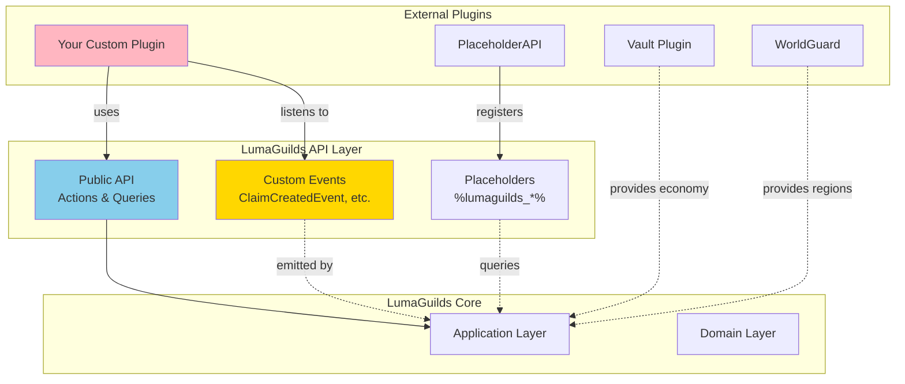
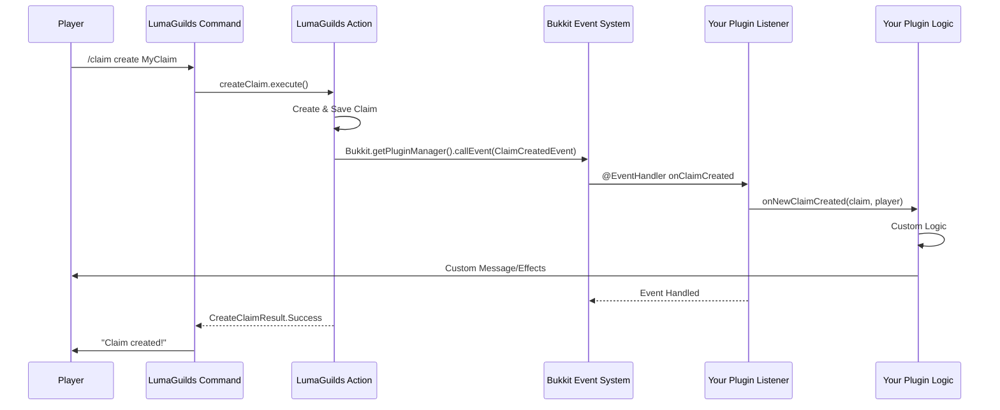
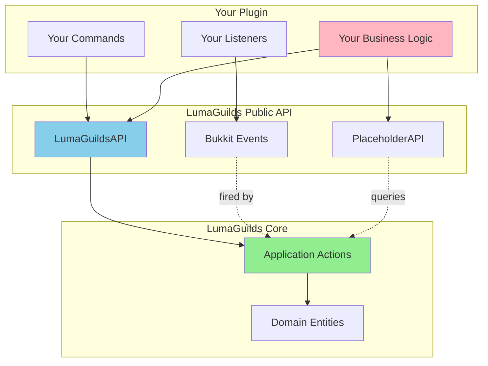

# Integration Guide

This guide covers advanced integration patterns for extending LumaGuilds with external plugins, custom features, and API integrations.

## Integration Architecture



## Using LumaGuilds from External Plugins

### Getting the Plugin Instance

```kotlin
package com.yourplugin

import net.lumalyte.lg.LumaGuildsPlugin
import org.bukkit.Bukkit

class YourPlugin : JavaPlugin() {
    private lateinit var lumaGuilds: LumaGuildsPlugin

    override fun onEnable() {
        // Get LumaGuilds instance
        lumaGuilds = Bukkit.getPluginManager().getPlugin("LumaGuilds") as? LumaGuildsPlugin
            ?: run {
                logger.severe("LumaGuilds not found!")
                Bukkit.getPluginManager().disablePlugin(this)
                return
            }

        logger.info("LumaGuilds integration enabled!")
    }
}
```

### Accessing Actions via Koin

```kotlin
import org.koin.core.component.KoinComponent
import org.koin.core.component.inject
import net.lumalyte.lg.application.actions.claim.GetClaimAtPosition

class YourFeature : KoinComponent {
    // Inject LumaGuilds actions
    private val getClaimAtPosition: GetClaimAtPosition by inject()
    private val createClaim: CreateClaim by inject()

    fun checkIfPositionIsClaimed(position: Position3D, worldId: UUID): Boolean {
        val result = getClaimAtPosition.execute(position, worldId)
        return result is GetClaimAtPositionResult.Success
    }
}
```

### Dependency Declaration

```yaml
# plugin.yml
name: YourPlugin
version: 1.0.0
depend:
  - LumaGuilds  # Hard dependency - won't load without it
softdepend:
  - Vault        # Optional dependency
api-version: "1.20"
```

## Listening to LumaGuilds Events

### Available Events

```kotlin
package net.lumalyte.lg.application.events

// Claim Events
data class ClaimCreatedEvent(
    val claim: Claim,
    val player: Player
) : Event()

data class ClaimDeletedEvent(
    val claimId: UUID,
    val player: Player
) : Event()

data class ClaimPermissionGrantedEvent(
    val claim: Claim,
    val targetPlayer: UUID,
    val permission: ClaimPermission,
    val grantedBy: UUID
) : Event()

// Guild Events
data class GuildCreatedEvent(
    val guild: Guild,
    val founder: UUID
) : Event()

data class GuildMemberJoinedEvent(
    val guild: Guild,
    val member: UUID
) : Event()

data class WarDeclaredEvent(
    val war: War,
    val attackingGuild: Guild,
    val defendingGuild: Guild
) : Event()

// Partition Events
data class PartitionModificationEvent(
    val claimId: UUID,
    val partitionId: UUID,
    val modificationType: ModificationType,
    val affectedChunks: List<Position2D>
) {
    enum class ModificationType {
        CREATED, RESIZED, REMOVED
    }
}
```

### Event Listener Example

```kotlin
package com.yourplugin.listeners

import net.lumalyte.lg.application.events.ClaimCreatedEvent
import org.bukkit.event.EventHandler
import org.bukkit.event.Listener

class LumaGuildsEventListener : Listener {

    @EventHandler
    fun onClaimCreated(event: ClaimCreatedEvent) {
        val claim = event.claim
        val player = event.player

        // Your custom logic
        player.sendMessage("Welcome to your new claim: ${claim.name}!")

        // Log to console
        logger.info("Player ${player.name} created claim ${claim.id}")

        // Integrate with your plugin's features
        yourPlugin.onNewClaimCreated(claim, player)
    }

    @EventHandler
    fun onWarDeclared(event: WarDeclaredEvent) {
        val war = event.war

        // Broadcast to server
        Bukkit.broadcastMessage(
            "§c⚔ War declared! ${event.attackingGuild.name} vs ${event.defendingGuild.name}"
        )

        // Start custom war mechanics
        yourPlugin.initializeWarZone(war)
    }

    @EventHandler
    fun onPartitionModified(event: PartitionModificationEvent) {
        // Update your plugin's chunk caches
        event.affectedChunks.forEach { chunkPos ->
            yourPlugin.invalidateChunkCache(chunkPos)
        }
    }
}
```

### Event Flow Diagram



## Custom PlaceholderAPI Placeholders

### Using LumaGuilds Placeholders

```kotlin
// Available placeholders:
// %lumaguilds_claim_count%        - Number of claims player owns
// %lumaguilds_guild_name%          - Player's guild name
// %lumaguilds_guild_level%         - Player's guild level
// %lumaguilds_guild_bank%          - Player's guild bank balance
// %lumaguilds_guild_member_count%  - Number of members in guild
// %lumaguilds_in_claim%            - true/false if player in claim
// %lumaguilds_claim_owner%         - Owner of claim player is in

// Example usage in scoreboard plugin config:
lines:
  - "&6Claims: &e%lumaguilds_claim_count%"
  - "&6Guild: &e%lumaguilds_guild_name%"
  - "&6Level: &e%lumaguilds_guild_level%"
```

### Creating Custom Placeholders

```kotlin
package com.yourplugin.placeholders

import me.clip.placeholderapi.expansion.PlaceholderExpansion
import net.lumalyte.lg.application.actions.claim.GetPlayerClaims
import org.bukkit.entity.Player
import org.koin.core.component.KoinComponent
import org.koin.core.component.inject

class YourCustomExpansion : PlaceholderExpansion(), KoinComponent {
    private val getPlayerClaims: GetPlayerClaims by inject()

    override fun getIdentifier() = "yourcustom"
    override fun getAuthor() = "YourName"
    override fun getVersion() = "1.0.0"

    override fun onPlaceholderRequest(player: Player?, params: String): String? {
        if (player == null) return null

        return when (params) {
            "total_claim_blocks" -> {
                // Calculate total blocks across all claims
                val claims = getPlayerClaims.execute(player.uniqueId)
                val totalBlocks = claims.sumOf { claim ->
                    getClaimBlockCount.execute(claim.id)
                }
                totalBlocks.toString()
            }

            "largest_claim_name" -> {
                // Find largest claim
                val claims = getPlayerClaims.execute(player.uniqueId)
                claims.maxByOrNull { claim ->
                    getClaimBlockCount.execute(claim.id)
                }?.name ?: "None"
            }

            else -> null
        }
    }
}

// Register in onEnable:
YourCustomExpansion().register()
```

## Public API Design Pattern

### Creating a Public API Interface

```kotlin
// In your plugin
package net.lumalyte.lg.api

interface LumaGuildsAPI {
    // Claim queries
    fun getClaimAt(position: Position3D, worldId: UUID): Claim?
    fun getPlayerClaims(playerId: UUID): List<Claim>
    fun isPositionClaimed(position: Position3D, worldId: UUID): Boolean

    // Permission checks
    fun canPlayerBuild(playerId: UUID, position: Position3D, worldId: UUID): Boolean
    fun canPlayerBreak(playerId: UUID, position: Position3D, worldId: UUID): Boolean

    // Guild queries
    fun getPlayerGuild(playerId: UUID): Guild?
    fun getGuildMembers(guildId: UUID): List<UUID>
    fun arePlayersInSameGuild(playerId1: UUID, playerId2: UUID): Boolean
}

// Implementation
class LumaGuildsAPIImpl(
    private val getClaimAtPosition: GetClaimAtPosition,
    private val getPlayerClaims: ListPlayerClaims,
    private val isPlayerActionAllowed: IsPlayerActionAllowed,
    private val getPlayerGuild: GetPlayerGuild,
    private val getGuildMembers: GetGuildMembers
) : LumaGuildsAPI {

    override fun getClaimAt(position: Position3D, worldId: UUID): Claim? {
        val result = getClaimAtPosition.execute(position, worldId)
        return (result as? GetClaimAtPositionResult.Success)?.claim
    }

    override fun isPositionClaimed(position: Position3D, worldId: UUID): Boolean {
        return getClaimAt(position, worldId) != null
    }

    override fun canPlayerBuild(
        playerId: UUID,
        position: Position3D,
        worldId: UUID
    ): Boolean {
        val result = isPlayerActionAllowed.execute(
            playerId,
            position,
            worldId,
            ClaimPermission.BUILD
        )
        return result is IsPlayerActionAllowedResult.Allowed
    }

    override fun getPlayerGuild(playerId: UUID): Guild? {
        return getPlayerGuild.execute(playerId)
    }

    override fun arePlayersInSameGuild(playerId1: UUID, playerId2: UUID): Boolean {
        val guild1 = getPlayerGuild(playerId1) ?: return false
        val guild2 = getPlayerGuild(playerId2) ?: return false
        return guild1.id == guild2.id
    }
}
```

### Exposing API to Other Plugins

```kotlin
// In main plugin class
class LumaGuildsPlugin : JavaPlugin() {
    companion object {
        @JvmStatic
        lateinit var api: LumaGuildsAPI
            private set
    }

    override fun onEnable() {
        // Initialize API
        api = LumaGuildsAPIImpl(
            get(), get(), get(), get(), get()
        )
    }
}

// Other plugins can access:
val api = LumaGuildsPlugin.api
val claim = api.getClaimAt(position, worldId)
```

## Integration Patterns

### Pattern 1: Territory Control Integration

```kotlin
/**
 * Example: Integrating with a war plugin
 * Restrict combat in non-PvP claims
 */
class CombatIntegration : Listener {
    private val api = LumaGuildsPlugin.api

    @EventHandler
    fun onEntityDamageByEntity(event: EntityDamageByEntityEvent) {
        val attacker = (event.damager as? Player) ?: return
        val victim = (event.entity as? Player) ?: return

        val location = victim.location
        val position = Position3D(location.blockX, location.blockY, location.blockZ)

        // Check if in claim
        val claim = api.getClaimAt(position, victim.world.uid) ?: return

        // Check if PvP flag enabled
        if (!doesClaimHaveFlag.execute(claim.id, ClaimFlag.PVP)) {
            event.isCancelled = true
            attacker.sendMessage("§cPvP is disabled in this claim!")
        }
    }
}
```

### Pattern 2: Economy Integration

```kotlin
/**
 * Example: Charge money for claim creation
 */
class EconomyIntegration(
    private val economy: Economy  // Vault economy
) : Listener {

    @EventHandler
    fun onClaimCreated(event: ClaimCreatedEvent) {
        val player = event.player
        val claim = event.claim
        val blockCount = getClaimBlockCount.execute(claim.id)

        val cost = blockCount * 10.0  // $10 per block

        if (!economy.has(player, cost)) {
            // Refund - delete claim
            deleteClaim.execute(claim.id)
            player.sendMessage("§cInsufficient funds! Need $$cost")
            return
        }

        economy.withdrawPlayer(player, cost)
        player.sendMessage("§aPaid $$cost for claim")
    }
}
```

### Pattern 3: Statistics Integration

```kotlin
/**
 * Example: Track claim statistics
 */
class StatisticsIntegration {
    private val statsDatabase = mutableMapOf<UUID, PlayerStats>()

    @EventHandler
    fun onClaimCreated(event: ClaimCreatedEvent) {
        val playerId = event.player.uniqueId
        val stats = statsDatabase.getOrPut(playerId) { PlayerStats() }

        stats.totalClaimsCreated++
        stats.totalBlocksClaimed += getClaimBlockCount.execute(event.claim.id)

        // Update leaderboard
        updateLeaderboard()
    }

    @EventHandler
    fun onClaimDeleted(event: ClaimDeletedEvent) {
        val playerId = event.player.uniqueId
        val stats = statsDatabase[playerId] ?: return

        stats.totalClaimsDeleted++
    }

    data class PlayerStats(
        var totalClaimsCreated: Int = 0,
        var totalClaimsDeleted: Int = 0,
        var totalBlocksClaimed: Int = 0
    )
}
```

### Pattern 4: Custom Commands Integration

```kotlin
/**
 * Example: Add custom command that uses LumaGuilds data
 */
@CommandAlias("myplugin")
class CustomCommands : BaseCommand(), KoinComponent {
    private val api = LumaGuildsPlugin.api

    @Subcommand("claiminfo")
    fun onClaimInfo(player: Player) {
        val position = player.location.toPosition3D()
        val claim = api.getClaimAt(position, player.world.uid)

        if (claim == null) {
            player.sendMessage("§cNot in a claim!")
            return
        }

        val guild = claim.teamId?.let { getGuildById.execute(it) }

        player.sendMessage("""
            §6=== Claim Info ===
            §eName: §f${claim.name}
            §eOwner: §f${Bukkit.getOfflinePlayer(claim.playerId).name}
            §eGuild: §f${guild?.name ?: "Personal"}
            §eBlocks: §f${getClaimBlockCount.execute(claim.id)}
            §eCreated: §f${claim.creationTime}
        """.trimIndent())
    }

    @Subcommand("nearbyclaims")
    fun onNearbyClaims(player: Player) {
        val claims = getAllClaims.execute().filter { claim ->
            claim.worldId == player.world.uid &&
            claim.position.distanceTo(player.location.toPosition3D()) < 100
        }

        player.sendMessage("§6Nearby Claims (within 100 blocks):")
        claims.forEach { claim ->
            player.sendMessage("§e- ${claim.name} §7(${claim.position.distanceTo(player.location.toPosition3D())} blocks away)")
        }
    }
}
```

## Advanced Integration: Custom Claim Flags

```kotlin
/**
 * Example: Adding custom claim flags via your plugin
 */
enum class CustomClaimFlag {
    CUSTOM_TELEPORT_ALLOWED,
    CUSTOM_FLY_ALLOWED,
    CUSTOM_KEEP_INVENTORY
}

class CustomFlagManager {
    // Store custom flags separate from LumaGuilds
    private val customFlags = mutableMapOf<UUID, MutableSet<CustomClaimFlag>>()

    fun enableFlag(claimId: UUID, flag: CustomClaimFlag) {
        customFlags.getOrPut(claimId) { mutableSetOf() }.add(flag)
    }

    fun disableFlag(claimId: UUID, flag: CustomClaimFlag) {
        customFlags[claimId]?.remove(flag)
    }

    fun hasFlag(claimId: UUID, flag: CustomClaimFlag): Boolean {
        return customFlags[claimId]?.contains(flag) ?: false
    }
}

// Usage in listeners
class CustomFlagListener(
    private val flagManager: CustomFlagManager
) : Listener {

    @EventHandler
    fun onPlayerTeleport(event: PlayerTeleportEvent) {
        val api = LumaGuildsPlugin.api
        val toPosition = event.to!!.toPosition3D()

        val claim = api.getClaimAt(toPosition, event.to!!.world.uid) ?: return

        if (!flagManager.hasFlag(claim.id, CustomClaimFlag.CUSTOM_TELEPORT_ALLOWED)) {
            event.isCancelled = true
            event.player.sendMessage("§cTeleportation is disabled in this claim!")
        }
    }
}
```

## Integration Diagram



## Best Practices

### 1. Don't Modify Core Data Directly
```kotlin
// ❌ Bad: Directly modifying domain entities
val claim = api.getClaimAt(position, worldId)
claim?.name = "New Name"  // Don't do this!

// ✅ Good: Use actions
updateClaimName.execute(claim.id, "New Name")
```

### 2. Handle Null Results
```kotlin
// ❌ Bad: Assuming data exists
val claim = api.getClaimAt(position, worldId)
player.sendMessage(claim.name)  // NPE if no claim!

// ✅ Good: Check for null
val claim = api.getClaimAt(position, worldId)
if (claim != null) {
    player.sendMessage(claim.name)
} else {
    player.sendMessage("Not in a claim!")
}
```

### 3. Listen to Events for Sync
```kotlin
// ❌ Bad: Polling for changes
scheduler.runTaskTimer(plugin, {
    checkForNewClaims()  // Expensive!
}, 20L, 20L)

// ✅ Good: React to events
@EventHandler
fun onClaimCreated(event: ClaimCreatedEvent) {
    handleNewClaim(event.claim)
}
```

## Related Documentation

- [Getting Started](./getting-started.md) - Basic development guide
- [Application Layer](./application.md) - Understanding actions
- [Architecture Overview](./architecture.md) - System design
- [Master Diagram](./master-diagram.md) - Complete system visualization
