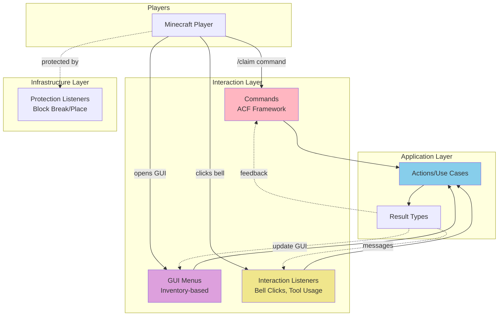
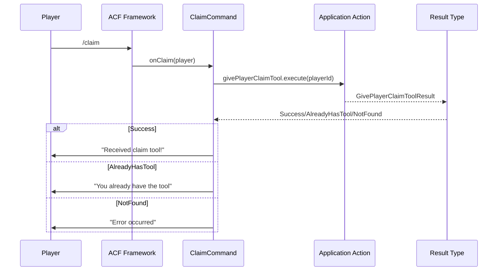
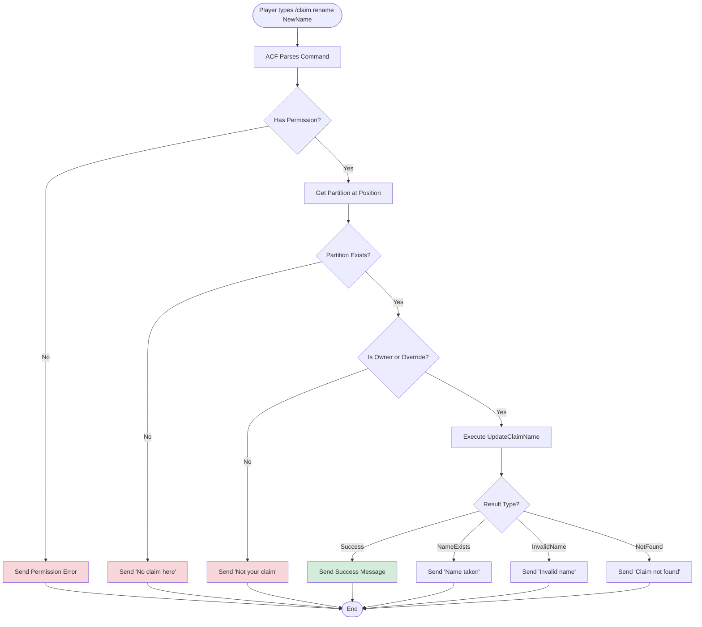
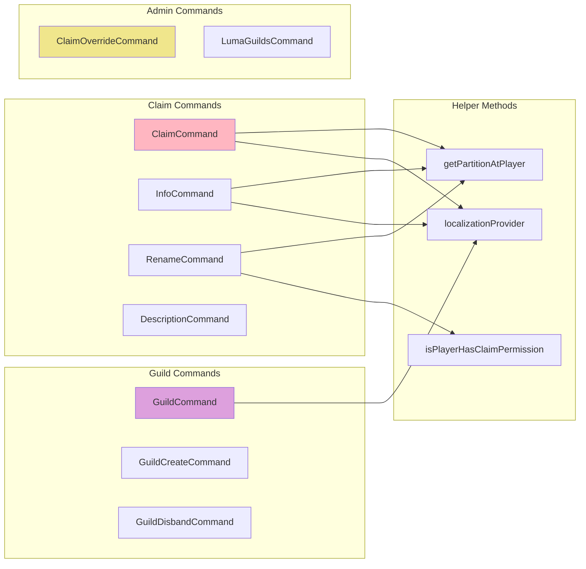
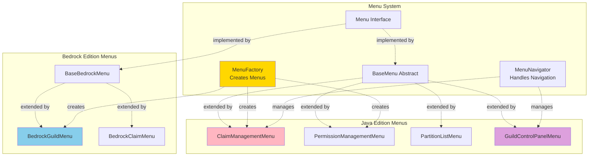
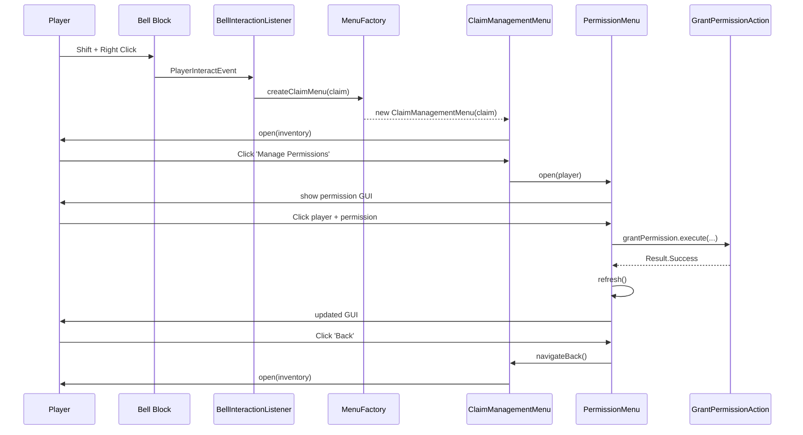
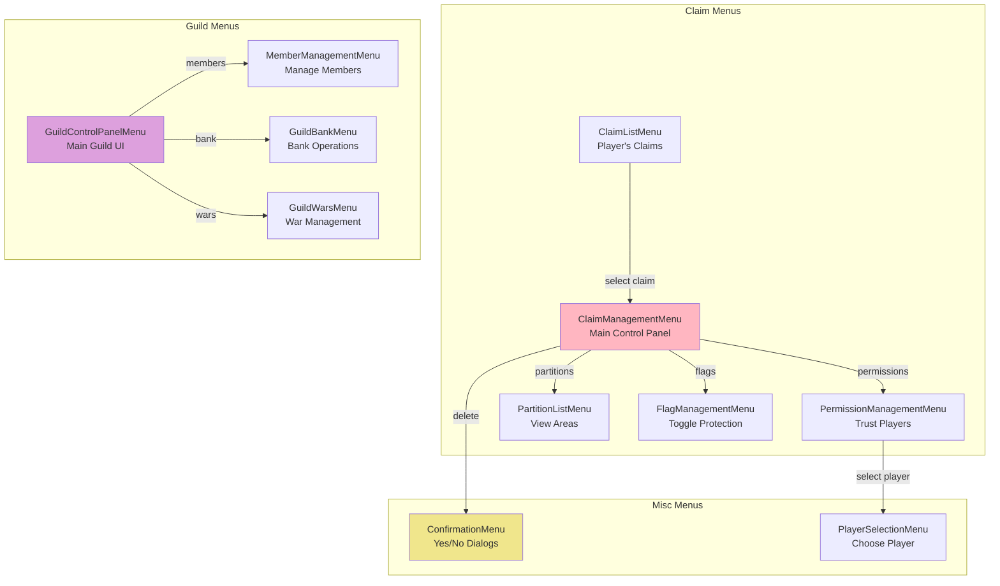
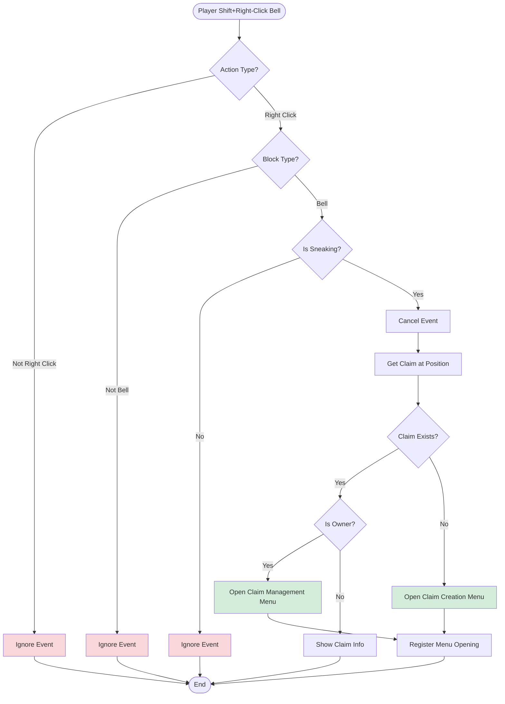

# Interaction Layer Documentation

The interaction layer (`net.lumalyte.lg.interaction`) handles all player-facing interactions including commands, GUI menus, and event listeners. This is the presentation layer of the hexagonal architecture.

## Interaction Layer Overview



## Package Structure

```
net.lumalyte.lg.interaction
├── commands/          # Player commands (ACF)
│   ├── ClaimCommand.kt
│   ├── GuildCommand.kt
│   ├── InfoCommand.kt
│   └── ...
├── menus/             # GUI implementations
│   ├── Menu.kt
│   ├── MenuFactory.kt
│   ├── MenuNavigator.kt
│   ├── bedrock/       # Bedrock Edition forms
│   ├── common/        # Java Edition GUIs
│   ├── guild/         # Guild-specific menus
│   ├── management/    # Claim management GUIs
│   └── misc/          # Utility menus
└── listeners/         # Player interaction listeners
    ├── BellInteractionListener.kt
    ├── ClaimToolListener.kt
    └── ...
```

## Commands

Commands use the ACF (Annotation Command Framework) for elegant command handling.

### Command Architecture



### ClaimCommand Example

```kotlin
package net.lumalyte.lg.interaction.commands

@CommandAlias("claim")
@CommandPermission("lumaguilds.command.claim")
class ClaimCommand : BaseCommand(), KoinComponent {
    private val localizationProvider: LocalizationProvider by inject()
    private val givePlayerClaimTool: GivePlayerClaimTool by inject()
    private val getPartitionByPosition: GetPartitionByPosition by inject()
    private val doesPlayerHaveClaimOverride: DoesPlayerHaveClaimOverride by inject()
    private val getClaimDetails: GetClaimDetails by inject()

    /**
     * Gives the player a claim tool.
     * Usage: /claim
     */
    @Default
    @Syntax("claim")
    fun onClaim(player: Player) {
        when (givePlayerClaimTool.execute(player.uniqueId)) {
            GivePlayerClaimToolResult.PlayerAlreadyHasTool ->
                player.sendMessage(localizationProvider.get(
                    player.uniqueId,
                    LocalizationKeys.COMMAND_CLAIM_ALREADY_HAVE_TOOL
                ))

            GivePlayerClaimToolResult.Success ->
                player.sendMessage(localizationProvider.get(
                    player.uniqueId,
                    LocalizationKeys.COMMAND_CLAIM_SUCCESS
                ))

            GivePlayerClaimToolResult.PlayerNotFound ->
                player.sendMessage(localizationProvider.get(
                    player.uniqueId,
                    LocalizationKeys.GENERAL_ERROR
                ))
        }
    }

    /**
     * Shows info about the claim at player's position.
     * Usage: /claim info
     */
    @Subcommand("info")
    @CommandPermission("lumaguilds.command.claim.info")
    fun onClaimInfo(player: Player) {
        val partition = getPartitionAtPlayer(player) ?: return
        val claim = getClaimDetails.execute(partition.claimId) ?: run {
            player.sendMessage("Claim not found!")
            return
        }

        player.sendMessage("""
            §6=== Claim Info ===
            §eName: §f${claim.name}
            §eDescription: §f${claim.description}
            §eOwner: §f${Bukkit.getOfflinePlayer(claim.playerId).name}
            §eSize: §f${getClaimBlockCount.execute(claim.id)} blocks
        """.trimIndent())
    }

    /**
     * Renames the claim at player's position.
     * Usage: /claim rename <new name>
     */
    @Subcommand("rename")
    @CommandPermission("lumaguilds.command.claim.rename")
    @Syntax("<new name>")
    fun onRename(player: Player, @Single newName: String) {
        val partition = getPartitionAtPlayer(player) ?: return

        if (!isPlayerHasClaimPermission(player, partition)) return

        when (val result = updateClaimName.execute(partition.claimId, newName)) {
            is UpdateClaimNameResult.Success ->
                player.sendMessage("§aClaim renamed to '${newName}'!")

            UpdateClaimNameResult.ClaimNotFound ->
                player.sendMessage("§cClaim not found!")

            UpdateClaimNameResult.NameAlreadyExists ->
                player.sendMessage("§cYou already have a claim with that name!")

            UpdateClaimNameResult.InvalidName ->
                player.sendMessage("§cInvalid name! Must be 1-50 characters.")
        }
    }

    // Helper methods
    private fun getPartitionAtPlayer(player: Player): Partition? {
        val partition = getPartitionByPosition.execute(
            player.location.toPosition3D(),
            player.world.uid
        )
        if (partition == null) {
            player.sendMessage(localizationProvider.get(
                player.uniqueId,
                LocalizationKeys.COMMAND_COMMON_UNKNOWN_PARTITION
            ))
        }
        return partition
    }

    private fun isPlayerHasClaimPermission(
        player: Player,
        partition: Partition
    ): Boolean {
        // Check admin override
        val overrideResult = doesPlayerHaveClaimOverride.execute(player.uniqueId)
        when (overrideResult) {
            is DoesPlayerHaveClaimOverrideResult.Success ->
                if (overrideResult.hasOverride) return true
            is DoesPlayerHaveClaimOverrideResult.StorageError ->
                return false
        }

        // Check ownership
        val claim = getClaimDetails.execute(partition.claimId) ?: return false
        if (player.uniqueId != claim.playerId) {
            player.sendMessage(localizationProvider.get(
                player.uniqueId,
                LocalizationKeys.COMMAND_COMMON_NO_CLAIM_PERMISSION
            ))
            return false
        }
        return true
    }
}
```

### Command Flow Diagram



### Common Command Patterns



## GUI Menus

Interactive inventory-based menus for claim and guild management.

### Menu Architecture



### Menu Interface

```kotlin
package net.lumalyte.lg.interaction.menus

interface Menu {
    /**
     * Opens the menu for the specified player.
     */
    fun open(player: Player)

    /**
     * Refreshes the menu content for the player.
     */
    fun refresh(player: Player)

    /**
     * Closes the menu for the player.
     */
    fun close(player: Player)

    /**
     * Handles click events within the menu.
     */
    fun handleClick(player: Player, slot: Int, clickType: ClickType)
}
```

### ClaimManagementMenu Example

```kotlin
package net.lumalyte.lg.interaction.menus.management

class ClaimManagementMenu(
    private val claim: Claim,
    private val getClaimBlockCount: GetClaimBlockCount,
    private val getClaimPermissions: GetClaimPermissions,
    private val menuNavigator: MenuNavigator
) : Menu {

    override fun open(player: Player) {
        val inventory = Bukkit.createInventory(
            null,
            54,
            "§6Manage: ${claim.name}"
        )

        // Claim info display
        inventory.setItem(4, ItemStack(Material.valueOf(claim.icon)).apply {
            itemMeta = itemMeta?.apply {
                setDisplayName("§6${claim.name}")
                lore = listOf(
                    "§7${claim.description}",
                    "",
                    "§eBlocks: §f${getClaimBlockCount.execute(claim.id)}",
                    "§eCreated: §f${claim.creationTime}"
                )
            }
        })

        // Manage permissions button
        inventory.setItem(20, ItemStack(Material.PLAYER_HEAD).apply {
            itemMeta = itemMeta?.apply {
                setDisplayName("§aManage Permissions")
                lore = listOf(
                    "§7Grant or revoke permissions",
                    "§7to other players",
                    "",
                    "§eClick to open"
                )
            }
        })

        // Manage partitions button
        inventory.setItem(22, ItemStack(Material.MAP).apply {
            itemMeta = itemMeta?.apply {
                setDisplayName("§aManage Partitions")
                lore = listOf(
                    "§7View and modify claim areas",
                    "",
                    "§eClick to open"
                )
            }
        })

        // Claim flags button
        inventory.setItem(24, ItemStack(Material.BANNER).apply {
            itemMeta = itemMeta?.apply {
                setDisplayName("§aManage Flags")
                lore = listOf(
                    "§7Toggle claim protection flags",
                    "",
                    "§eClick to open"
                )
            }
        })

        // Transfer claim button
        inventory.setItem(40, ItemStack(Material.ENDER_PEARL).apply {
            itemMeta = itemMeta?.apply {
                setDisplayName("§6Transfer Claim")
                lore = listOf(
                    "§7Transfer ownership to another player",
                    "",
                    "§eClick to transfer"
                )
            }
        })

        // Delete claim button
        inventory.setItem(49, ItemStack(Material.BARRIER).apply {
            itemMeta = itemMeta?.apply {
                setDisplayName("§cDelete Claim")
                lore = listOf(
                    "§7Permanently remove this claim",
                    "§c§lWarning: This cannot be undone!",
                    "",
                    "§eClick to delete"
                )
            }
        })

        player.openInventory(inventory)
    }

    override fun handleClick(player: Player, slot: Int, clickType: ClickType) {
        when (slot) {
            20 -> {
                // Open permission management menu
                menuNavigator.navigateTo(
                    player,
                    PermissionManagementMenu(claim, /* ... */)
                )
            }
            22 -> {
                // Open partition list menu
                menuNavigator.navigateTo(
                    player,
                    PartitionListMenu(claim, /* ... */)
                )
            }
            24 -> {
                // Open flags menu
                menuNavigator.navigateTo(
                    player,
                    FlagManagementMenu(claim, /* ... */)
                )
            }
            40 -> {
                // Open transfer menu
                menuNavigator.navigateTo(
                    player,
                    TransferClaimMenu(claim, /* ... */)
                )
            }
            49 -> {
                // Open delete confirmation
                menuNavigator.navigateTo(
                    player,
                    ConfirmDeleteMenu(claim, /* ... */)
                )
            }
        }
    }

    override fun refresh(player: Player) {
        open(player)  // Recreate inventory with updated data
    }

    override fun close(player: Player) {
        player.closeInventory()
    }
}
```

### Menu Navigation Flow



### Menu Types Diagram



## Interaction Listeners

Handle player interactions with claim tools and bells.

### BellInteractionListener

```kotlin
package net.lumalyte.lg.infrastructure.listeners

class BellInteractionListener(
    private val getClaimAtPosition: GetClaimAtPosition,
    private val menuFactory: MenuFactory,
    private val registerClaimMenuOpening: RegisterClaimMenuOpening
) : Listener {

    @EventHandler(priority = EventPriority.HIGH)
    fun onPlayerInteractBell(event: PlayerInteractEvent) {
        if (event.action != Action.RIGHT_CLICK_BLOCK) return
        if (event.clickedBlock?.type != Material.BELL) return
        if (!event.player.isSneaking) return

        event.isCancelled = true

        val player = event.player
        val bellPosition = event.clickedBlock!!.location.toPosition3D()

        // Get claim at bell position
        val result = getClaimAtPosition.execute(
            bellPosition,
            player.world.uid
        )

        when (result) {
            is GetClaimAtPositionResult.Success -> {
                // Register menu opening to prevent protection
                registerClaimMenuOpening.execute(player.uniqueId)

                // Open claim management menu
                val menu = menuFactory.createClaimManagementMenu(result.claim)
                menu.open(player)
            }
            is GetClaimAtPositionResult.NotFound -> {
                // Open claim creation menu
                val menu = menuFactory.createClaimCreationMenu(bellPosition)
                menu.open(player)
            }
        }
    }
}
```

### Interaction Flow Diagram



## Localization

Multi-language support using localization keys.

```kotlin
package net.lumalyte.lg.application.utilities

class LocalizationProvider(
    private val playerStateRepository: PlayerStateRepository
) {
    private val translations = mutableMapOf<String, MutableMap<String, String>>()

    init {
        loadTranslations()
    }

    fun get(playerId: UUID, key: LocalizationKeys): String {
        val playerLang = playerStateRepository.getLanguage(playerId) ?: "en_US"
        return translations[playerLang]?.get(key.key) ?: key.default
    }

    private fun loadTranslations() {
        // Load from files
        translations["en_US"] = mutableMapOf(
            "command.claim.success" to "§aYou received the claim tool!",
            "command.claim.already_have_tool" to "§cYou already have the claim tool!",
            "command.common.no_permission" to "§cYou don't have permission to do that!"
        )
    }
}

enum class LocalizationKeys(val key: String, val default: String) {
    COMMAND_CLAIM_SUCCESS("command.claim.success", "You received the claim tool!"),
    COMMAND_CLAIM_ALREADY_HAVE_TOOL("command.claim.already_have_tool", "You already have the claim tool!"),
    COMMAND_COMMON_NO_PERMISSION("command.common.no_permission", "You don't have permission!"),
    // ... more keys
}
```

## Best Practices

### 1. Always Use Result Types
Never throw exceptions for business logic failures in commands:

```kotlin
// Good: Handle all result cases
when (val result = createClaim.execute(/* ... */)) {
    is CreateClaimResult.Success -> player.sendMessage("Success!")
    CreateClaimResult.LimitExceeded -> player.sendMessage("Limit exceeded!")
    // ... handle all cases
}

// Bad: Let exceptions bubble up
try {
    val claim = createClaimUnsafe(/* ... */)
    player.sendMessage("Success!")
} catch (e: Exception) {
    player.sendMessage("Error!")
}
```

### 2. Use Localization
Always use localization keys for messages:

```kotlin
// Good: Localized
player.sendMessage(localizationProvider.get(
    player.uniqueId,
    LocalizationKeys.COMMAND_CLAIM_SUCCESS
))

// Bad: Hardcoded
player.sendMessage("§aYou received the claim tool!")
```

### 3. Validate Early
Check permissions and preconditions before opening menus:

```kotlin
// Good: Check first
if (!player.hasPermission("lumaguilds.command.claim")) {
    player.sendMessage("No permission!")
    return
}
val partition = getPartitionAtPlayer(player) ?: return
openMenu(player, partition)

// Bad: Check after expensive operations
val partition = getPartitionAtPlayer(player) ?: return
loadAllData()
if (!player.hasPermission("lumaguilds.command.claim")) return
```

### 4. Cancel Events Appropriately
Only cancel events when you handle them:

```kotlin
@EventHandler
fun onInteract(event: PlayerInteractEvent) {
    if (event.clickedBlock?.type != Material.BELL) return  // Don't cancel
    if (!event.player.isSneaking) return  // Don't cancel

    event.isCancelled = true  // Now cancel - we're handling it
    // Handle bell interaction...
}
```

## Related Documentation

- [Application Layer](./application.md) - Actions used by commands
- [Infrastructure Layer](./infrastructure.md) - Event listeners and adapters
- [Getting Started](./getting-started.md) - Creating custom commands
- [Master Diagram](./master-diagram.md) - Full system flow
