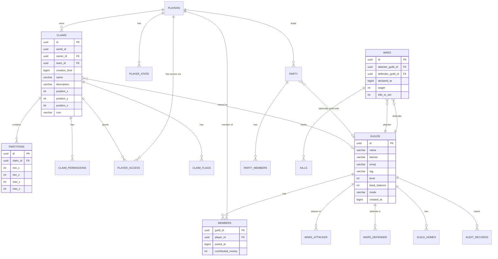

# Master System Diagram

This document provides comprehensive visual maps of the entire LumaGuilds plugin, showing how all components interact across all layers.

## Complete System Architecture

## End-to-End: Creating a Claim

Complete flow from player command to database storage.

## End-to-End: Permission Check (Block Break)

Complete protection flow.

## Guild System Complete Flow

## Data Flow Architecture

## Component Dependency Graph

## Claim Permission System Map

## Database Schema Relationships

## Plugin Lifecycle

## Cache Strategy

## Complete Feature Map

## Summary

This master diagram document provides:

1. **Complete System Architecture** - All layers and their interactions
2. **End-to-End Flows** - Real user scenarios from start to finish
3. **Component Dependencies** - How modules depend on each other
4. **Data Flow** - How information moves through the system
5. **Database Relationships** - Complete schema visualization
6. **Plugin Lifecycle** - Startup and shutdown sequences
7. **Cache Strategy** - Performance optimization approach
8. **Feature Map** - Complete functionality overview

Use these diagrams to:
- Understand how the entire system works together
- Debug issues by following the flow
- Plan new features by seeing integration points
- Onboard new developers quickly
- Document architectural decisions

## Related Documentation

- [Architecture Overview](./architecture.md) - Hexagonal architecture principles
- [Domain Layer](./domain.md) - Core business logic
- [Application Layer](./application.md) - Use cases and actions
- [Infrastructure Layer](./infrastructure.md) - External integrations
- [Interaction Layer](./interaction.md) - User interface
- [Getting Started](./getting-started.md) - Development guide
- [Integration Guide](./integration.md) - Extending the plugin
