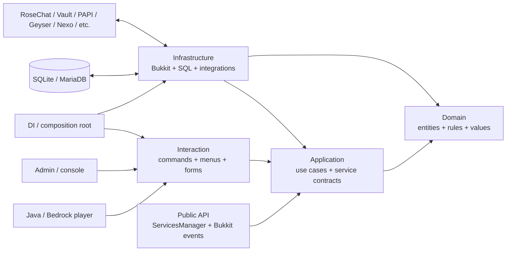

# Master diagram

Dependency direction for the enforced core is inward: infrastructure → application → domain.

Player input enters through interaction; persistence and platform effects leave through infrastructure. Cross-plugin consumers should use the public API or Bukkit events instead of reaching into Koin/internal repositories.
